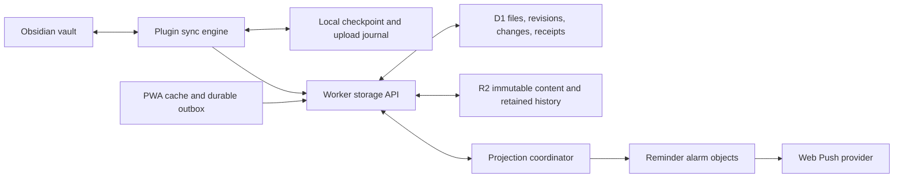

# Crate pre-release engineering audit

> Historical snapshot before remediation. See [fixes and the second verification pass](pre-release-fixes-2026-09-29.md) for current status.

**Audited:** 29 September 2026 · commit `226e72e262532eec7bde02e52828652c5354ab81` · plugin 0.4.0 · protocol 1 · server revision 2 · D1 schema 2.

This is an audit of the implementation and its distributed behavior, not a proposed rewrite. No production source was changed. Temporary reproductions and logs are preserved in [local audit evidence](../.generated/pre-release-audit/README.md), outside the normal test suite. Filesystem race reproductions inject interleavings at the Obsidian adapter boundary; they are not physical-device tests.

## 1. Executive summary

**I would not approve this candidate for public release today.** Crate has a substantially stronger foundation than a basic file uploader: conditional publication, immutable remote file versions, durable operation receipts, crash-recoverable checkpoints, scoped browser credentials, protected offline mutations, and extensive integration tests. Most of the difficult distributed-system cases are explicitly handled.

The remaining problems are concentrated at boundaries. Two local recovery actions can overwrite an intervening edit without retaining it. Markdown auto-merge can turn two valid frontmatter documents into invalid YAML and report success. A remote text application can follow a renamed Obsidian file object into a different path. Public API admission does not protect expensive unauthenticated reads, and the fallback rate counter does not survive its request wrapper. Several byte-preservation tests compare ArrayBuffers using a matcher that does not compare their contents.

These are practical defects, not arguments for a new synchronization architecture. Fix the local mutation boundary, make structured Markdown merging conservative, repair the test assertions, and close the admission gaps. Retain the existing journal/CAS design.

Validation performed with Node **v26.8.2** and npm **11.19.1**:

| Check | Result |
| --- | --- |
| `npm run check` | Passed: lint, both production typechecks, dead-code checks, third-party notices, CI/revision checks, 32 recovery tests, **3,779 unit tests**, **561 Worker integration tests**, and 16 local-server tests. Two existing lint deprecation warnings. |
| Production plugin build, CSS scope, size gates, release-artifact verifier | Passed. Worker production build also ran through the checks. |
| Activity, conflict-review, and file-history browser checks | Passed in Chromium and WebKit, including mobile/desktop widths and light/dark themes. |
| Packaged standalone server | Passed installation/startup/persistence test outside the repository. |
| PWA smoke test | Passed. |
| Visual/editor typechecks; Reading extraction/server/shortcut checks | Passed; Reading checks include 8 extraction and 9 server/shortcut tests. |
| `npm run test:pwa-browser` | **All 46 browser checks passed**, covering Chromium and WebKit, offline/storage recovery, auth, multi-tab convergence, updates, push registration, capacity, and shared interactions. |
| `npm run security:check` | **Failed** on the Undici advisory in F6. The chained secret scan therefore did not run in that command. |
| Separate `npm run security:secrets` | Passed: **925 commits** and the current source scanned; no detected secrets. The reviewed exception is a public OAuth client identifier. |
| Standalone-server dependency audit | **Failed:** the same advisory affects its direct `undici@7.29.0` dependency. |
| Targeted audit reproductions | **Seven safety assertions failed**, establishing F1–F5 below. These were added after the passing baseline run and archived afterward. |

This audit did not complete a fresh hosted Cloudflare acceptance run, physical iOS/Android acceptance, native Obsidian filesystem testing, actual provider push delivery, Docker architecture testing, or the entire screenshot/Reading-browser release matrix. The full `release:check` cannot currently pass its security prerequisite. Acceptance records are intentionally external to Git; their absence here does not establish that maintainers have never performed those checks.

## 2. Release blockers

### F1 — Recovery actions can destroy edits made after their last check

- **Severity:** BLOCKER.
- **Confidence:** Confirmed by two adapter-level failure-injection tests.
- **Classification / area:** Confirmed bug · Obsidian filesystem, conflict resolution, local discard, data safety.
- **Problem:** Binary conflict resolution overwrites the original after checking it. Hidden-file discard also uses an overwriting adapter write after an absence check. Neither operation protects the last asynchronous gap.
- **Why it matters:** The intervening bytes can disappear from every copy Crate retains. A user choosing a reviewed version is not approving destruction of a later, unseen edit from Obsidian or another plugin. The modal can report successful recovery despite this loss.
- **Concrete failure sequence A:** (1) A conflict review captures current bytes `[1,2]` and saved bytes `[3,4]`. (2) The user chooses **Use saved copy**. (3) Crate backs up those two snapshots and re-verifies the files. (4) Another writer saves `[5,6]` during the awaited write-side identity check. (5) `writeBinary` replaces them with `[3,4]`. Resolution succeeds; the original and recovery copies contain only `[1,2]` or `[3,4]`. The new edit is gone. This applies to the binary branch, which also includes text files excluded from preview by its 1 MB limit.
- **Concrete failure sequence B:** (1) A previously synced hidden file is locally deleted. (2) The user discards that deletion to restore the baseline. (3) The final `stat` observes absence. (4) Another writer recreates the file before the awaited result is acted on. (5) `adapter.writeBinary` overwrites the recreation. There was no local file in the reviewed snapshot, so no recovery copy contains those new bytes.
- **Relevant files/symbols:** [conflict-review.ts](../src/sync/conflict-review.ts), `createConflictReview().resolve`, lines 70–98; [conflict-review-file.ts](../src/sync/conflict-review-file.ts), `writeBinary`; [pending-discard.ts](../src/sync/pending-discard.ts), `discardOne`, lines 102–128. Compare the safer binary path in [history-restore.ts](../src/sync/history-restore.ts).
- **Root cause:** Content checking, backup, and destructive replacement are separate operations. The safety boundary differs between automatic sync, history restore, conflict resolution, and discard. A pre-write `stat` is not a conditional create.
- **Recommended change:** Route these actions through a common, narrowly scoped safe-file mutation boundary. Use atomic text processing with identity and preimage checks. For binary replacement, preserve the actual file being displaced in local trash/recovery, then use a host-supported non-overwriting create. Never substitute hidden-path `writeBinary` for conditional creation. If the host cannot guarantee preservation, retain the incoming copy and leave the action unresolved. Verify the behavior on actual supported Obsidian adapters.
- **Tests that should prove the fix:** Inject edits/recreation after every awaited read, backup verification, identity check, trash, and create. Assert exact byte conservation across the original, recovery files, and trash, including hidden files, >1 MB text, save errors, plugin unload, and restart. The two archived F1 tests must pass using byte-aware assertions.

### F2 — Automatic Markdown merge publishes invalid frontmatter as a successful sync

- **Severity:** CRITICAL; blocks release because this is silent metadata corruption on a routine two-device workflow.
- **Confidence:** Confirmed with two production SyncEngines calling the Worker and real local D1/R2 bindings.
- **Classification / area:** Confirmed bug · merge semantics, note metadata, plugin/backend boundary.
- **Problem:** Different insertions at the same line position are concatenated deterministically without considering frontmatter structure. The inline merger's frontmatter exclusions do not protect this earlier line-level branch.
- **Why it matters:** Preserving all text does not preserve a valid document. Obsidian properties and other plugins may reject the YAML or interpret only one conflicting property. Crate reports no conflict or error, so the user has no reason to inspect the result.
- **Concrete failure sequence:** A and B share `title: Note` frontmatter. Offline, A adds `tags: [alpha]` and B adds `tags: [beta]` at the same position. A uploads, then B syncs. B reports `success: true`, `merged: 1`, `conflicts: []`, `errors: []`. The committed remote note contains:

  ```yaml
  ---
  title: Note
  tags: [alpha]
  tags: [beta]
  ---
  ```

  The installed YAML parser rejects the duplicate mapping key. This is not merely a suspicious hypothetical diff. The audit downloaded this result from the Worker after the merge.
- **Relevant files/symbols:** [text-merge.ts](../src/sync/text-merge.ts), `mergeSequences`, same-point insertion branch; [markdown-merge.ts](../src/sync/markdown-merge.ts), `mergeMarkdownContent`; [markdown-inline-merge.ts](../src/sync/markdown-inline-merge.ts), `createInlineMerger`; [transfer-process.ts](../src/sync/transfer-process.ts), `tryAutoMergeMarkdownConflict`, which uploads the result before local application.
- **Root cause:** The merge success criterion is non-overlapping sequence operations, not preservation of structured regions. Deterministic ordering ensures convergence but cannot establish semantic correctness.
- **Recommended change:** Treat competing edits in frontmatter and other structured Markdown regions conservatively. At minimum, detect conflicting insertions and refuse invalid merged YAML before publication. Do not silently pick a winning duplicate key. A targeted frontmatter merge may combine genuinely independent keys, with explicit handling of nested mappings and sequences; ordinary prose merging can remain unchanged.
- **Tests that should prove the fix:** Run both arrival orders through actual engines; cover duplicate keys, nested mappings, independent keys, anchors/aliases, BOM/CRLF, fenced structured data, and reminder metadata. Each result must remain valid with specified semantics or create a recoverable conflict. Retained history provides some recovery today, but does not make the silent corruption acceptable.

F3–F5 below should also be resolved before release. F6 is a lower-severity dependency finding that nevertheless prevents the repository's mandatory security gate from passing.

## 3. Critical/high-priority findings

### F3 — A remote write can follow a renamed TFile into the wrong path

- **Severity:** HIGH.
- **Confidence:** High; reproduced with a mutable TFile adapter seam. Native-host timing has not been reproduced in this audit.
- **Classification / area:** Confirmed boundary behavior / likely host race · Obsidian sync application.
- **Problem:** `readLocalSnapshot` retains a TFile object across asynchronous reading and hashing. Its later atomic callback checks text equality, but does not check that this is still the file at the planned path.
- **Why it matters:** A rename can redirect a remote write to a destination outside the operation, including an excluded folder. The local checkpoint is then associated with the old path. Content CAS alone does not establish path identity.
- **Concrete failure sequence:** Sync plans a download for `note.md`; local text equals the baseline. While its read/hash yields, Obsidian renames the same TFile to `excluded/note.md`. The object's text is unchanged, so `vault.process(snapshot.visibleFile, update)` passes the content check and writes the remote replacement at the new path. The archived test returns `status: applied` and shows the destination containing the remote replacement.
- **Relevant files/symbols:** [local-apply.ts](../src/sync/local-apply.ts), `readLocalSnapshot` at line 113 and `writeLocalContent` at line 153. [vault-markdown.ts](../src/reminders/data/vault-markdown.ts), `processVaultMarkdown`, already checks `file.path` inside the atomic callback.
- **Root cause:** Different local writers enforce different identity invariants. The engine test filesystem does not model a rename by mutating the retained TFile in the same way this boundary requires.
- **Recommended change:** Capture the expected path and object identity, revalidate both in the atomic callback, and defer/replan if either changed. Reuse this check across local sync and reminder mutations; do not hold a global vault lock over network work.
- **Tests that should prove the fix:** Rename before/during hash and before the atomic callback; move into excluded/hidden locations; rename then recreate the old path; replace a file object with identical text. Assert no unintended path is written, the checkpoint is not advanced for the wrong file, and native Obsidian behaves like the updated test seam.

### F4 — Unauthenticated API work bypasses admission; the fallback counter resets per request

- **Severity:** HIGH.
- **Confidence:** Confirmed by Worker integration tests and the routing call chain. Account exhaustion was not load-tested.
- **Classification / area:** Confirmed missing protection and bug · abuse resistance, backend availability/cost.
- **Problem:** Pre-auth admission only covers an allowlist of notification/Reading write routes. GETs and generic sync routes bypass it. Reading requests reach the shared projection Durable Object before authentication. The fallback counter is keyed by a database object that is freshly wrapped for each request.
- **Why it matters:** A public Worker URL is sufficient to trigger billed work and occupy a coordinator needed by legitimate users. This is a denial-of-service/cost risk, not an authentication bypass or demonstrated data disclosure.
- **Concrete failure sequence A:** An attacker sends invalid Bearer requests to `/reading/list`. The Worker forwards to the single projection object; its locked internal handler schedules maintenance before authentication rejects the request. Invalid `/sync/manifest` and even invented routes with a Bearer token reach a D1 token lookup. A configured limiter that always denies was called **zero times**; all three probes returned 401.
- **Concrete failure sequence B:** On a local/older deployment without the edge binding, send 65 invalid enrollment exchanges inside a minute. Every request returned 401; none returned 429. `withD1Usage` constructs a new database wrapper, so the WeakMap in `limitNotificationRequest` starts a new budget for each request.
- **Relevant files/symbols:** [rate-limit.ts](../src/cloudflare/worker/rate-limit.ts), `limitNotificationRequest`; [request-handler.ts](../src/cloudflare/worker/request-handler.ts), lines 56–70; [coordinator-requests.ts](../src/cloudflare/worker/coordinator-requests.ts), `handleLockedCoordinatorRequest`; [d1-usage.ts](../src/cloudflare/worker/d1-usage.ts), `withD1Usage` / `meterD1Usage`; [authenticate.ts](../src/cloudflare/worker/authenticate.ts).
- **Root cause:** Security admission is a feature-specific write helper rather than an outer routing boundary. Instrumentation changes the identity used for fallback state. The actions map even includes `/features`, while the outer prefix check excludes it.
- **Recommended change:** Validate route/method before authentication work; apply inexpensive IP-based admission to all protected API classes before D1/DO calls; authenticate before forwarding to the coordinator. Keep separate authenticated budgets for legitimate bulk sync. Make the local fallback use stable deployment state and explicitly document that it cannot provide a globally distributed limit.
- **Tests that should prove the fix:** Denied GET/write requests perform no D1/R2/DO work; invented routes return 404 cheaply; counters accumulate across actual instrumented requests; different senders do not share one accidental bucket; supported bootstrap and reconnect workloads are not throttled into permanent failure.

### F5 — Several data-integrity assertions do not compare bytes

- **Severity:** HIGH.
- **Confidence:** Confirmed against the installed Vitest 4.1.11 matcher implementation and a minimal test.
- **Classification / area:** Missing test protection · sync, recovery, merge verification.
- **Problem:** Tests use `toEqual` / `toContainEqual` directly on ArrayBuffer values. In this setup, buffers containing `[1,2]` and `[3,4]` compare equal. The matcher used by `toStrictEqual` includes an ArrayBuffer comparison; the ordinary matcher does not.
- **Why it matters:** A test can claim that original bytes survived or that incoming bytes were backed up while accepting different bytes. The initial F1 reproduction itself appeared to pass until the assertion compared byte arrays. This materially reduces the confidence warranted by the green test count.
- **Concrete failure sequence:** Implementation overwrites a protected buffer with different bytes; the test calls `expect(actualBuffer).toEqual(expectedBuffer)`; the assertion passes. The audit's `expect([1,2].buffer).not.toEqual([3,4].buffer)` equivalent fails, proving the blind spot.
- **Relevant files/symbols:** [local-apply.test.ts](../src/sync/local-apply.test.ts), including lines 58, 92, 121–122; [pending-discard.test.ts](../src/sync/pending-discard.test.ts); [history-restore.test.ts](../src/sync/history-restore.test.ts); [markdown-base-cache.test.ts](../src/sync/markdown-base-cache.test.ts); [conflict-review.test.ts](../src/sync/conflict-review.test.ts); [history-state-restore.integration.ts](../src/cloudflare/worker/history-state-restore.integration.ts). This does not invalidate string/hash assertions elsewhere, including the large-vault and 25 MiB transport checks.
- **Root cause:** The tests assume structural object equality implies binary equality. Some comparisons nest buffers inside arrays/objects, which preserves the same weakness.
- **Recommended change:** Introduce a small `expectBytesEqual` test helper using typed arrays or explicit byte comparison; use it for preservation, transport, and restore assertions. Verify byte length as well. Audit nested buffer comparisons and use a strict matcher only where its cross-realm behavior is understood.
- **Tests that should prove the fix:** Deliberately change one byte, truncate, append, and swap same-length buffers. Every affected assertion must fail. Re-run the repaired safety suites and the new race reproductions before relying on their results for release approval.

## 4. Sync correctness assessment

Crate is a per-vault distributed system. The filesystem is local truth; D1 describes the current remote state; R2 stores immutable content; local checkpoints record the common baseline. The PWA is a command client over reminders derived from Markdown, not a second generic vault synchronizer.



**Bootstrap and inventory.** The explicit initial import has durable server progress and bounded batches. Full reconciliation discovers local files, obtains a paginated remote manifest, then catches up changes after its watermark. It does not assume a multi-page inventory is an immutable snapshot. Namespace/topology validation rejects ambiguous case/Unicode paths and file-versus-directory conflicts. Discovery errors fail closed instead of looking like mass deletions.

**Incremental work.** Local filesystem events feed a coalesced queue. Periodic sync and rotating content verification supplement events and metadata shortcuts. Remote changes use ordered sequence numbers, with paginated catch-up and full reconciliation after cursor expiry. Modification timestamps are hints; hashes and revisions determine authority. Client clock skew is not used to choose the winning file contents.

**Uploads.** The plugin persists operation identity and exact bytes before network mutation. The server stages an immutable R2 object and conditionally publishes its D1 pointer. The same database transaction records changes, history/projection work, and operation outcome. A lost response can replay the same operation without creating a second mutation. Merged uploads retain a local preimage so crash recovery does not mistake the uploaded merge for an applied local edit.

**Downloads.** Content hashes are verified. Existing text uses an atomic Obsidian processing callback that checks the preimage. F3 shows the missing path-identity check. Binary overwrites are normally deferred into an incoming review copy; F1 shows that the explicit recovery path is less safe than this automatic path. Checkpoints are persisted before the remote cursor advances, and errors prevent a false complete checkpoint.

**Deletes and renames.** A delete consumes an expected hash and exact remote revision, protecting a newly recreated same-byte file from an older deletion. Local remote-deletion handling uses local trash to preserve last-moment bytes. Rename is a destination create plus source delete, with a durable dependency that prevents source deletion before the destination upload succeeds. There is no global logical file ID linking arbitrary cross-device renames.

**Conflict policy.** Known-base Markdown uses a bounded three-way merge, with unresolved conflicts retaining copies. Concurrent creates without a common base are conflicts. An edit wins over a concurrent deletion, preserving the edited note; a remote edit also defeats a stale local deletion. This deliberately allows a deleted path to reappear when another device has a real edit. That is the chosen preservation policy, not a last-writer-wins timestamp algorithm.

Realistic outcomes today:

| History | What Crate does |
| --- | --- |
| A and B edit independent prose from a common base | Merges when the bounded diff permits it; otherwise preserves a conflict. F2 is an unsafe structured-data exception. |
| A edits; B deletes, in either arrival order | Preserves the edit. A path the user deleted can return; history records the resolved race. |
| A renames `old.md` to `new.md`; B edits `old.md` | Can retain edited `old.md` plus `new.md` carrying the renamed version. No cross-path identity exists to apply B's edit automatically at the new name. |
| A and B rename the same file differently | Retains both destination names. This conserves content but requires user reconciliation. |
| Delete then recreate with identical bytes; stale third device deletes | Exact revision matching protects the recreated incarnation. |
| PWA queues an edit; plugin changes the reminder before delivery | Reminder revision mismatch rejects the stale command; the PWA retains recoverable pending text instead of rebasing it silently. |
| Server commits; response disappears; client restarts | Durable receipt and exact operation replay resolve the uncertainty. Upload state is not inferred from the missing HTTP response. |
| Client stops partway through a remote page | Earlier file changes may exist locally; checkpoint/cursor ordering makes re-reading safe. This is recoverable partial progress, not an all-vault transaction. |
| Device reconnects after weeks offline | Expired cursor causes full reconciliation; retained local bases support merging even if remote history expired. Missing bases produce conflicts rather than invented ancestry. |
| An operation is older than its 180-day retry window | Server rejects it as expired; the UI/journal must retain the bytes for review rather than generate a new operation and replay it blindly. |

Critical invariants and actual enforcement:

| Invariant | Enforcement / gap |
| --- | --- |
| Remote contents and published metadata refer to the same bytes | Immutable R2 keys, hash/size verification, staged-upload journal, conditional D1 transaction; no cross-service atomic transaction is assumed. |
| A stale mutation must not overwrite current remote state | Upload hash CAS; reminder semantic revisions; exact delete/restore incarnation where applicable. |
| Retries must not apply a mutation twice | Durable operation ID plus request fingerprint and receipt; retention/expiry contract. |
| Delete must not consume a recreated incarnation | Revision check in the D1 mutation, beyond content equality. |
| Local replacement must refer to the reviewed path and bytes | Text preimage check exists; F1 and F3 violate the complete invariant in specific branches. |
| Auto-merge must not silently corrupt structured metadata | **Not enforced** for line-level frontmatter insertion; F2. |
| Pending browser changes survive uncertain outcomes | Persist-before-optimism outbox, immutable retry body, cross-tab lock, quarantine/export. Browser storage eviction remains outside the application's guarantees. |
| Published live paths must form a portable namespace | Database uniqueness plus transactional topology checks, with client validation. |
| A corrupt checkpoint must not become a new empty authority | Version/authority/generation validation and recoverable temporary checkpoint; fail-closed recovery. |

## 5. Sync threat model

| Threat | Protection today | Residual risk |
| --- | --- | --- |
| Lose a newer local edit | Atomic text preimage checks, conflict copies, local trash, journals | **Not fully protected:** F1 can lose the final edit during recovery. F3 can write an unintended renamed path. |
| Overwrite newer remote content with stale data | Hash/revision CAS and semantic reminder revisions | Strong for the traced operations; repair UI must preserve the same preconditions. |
| Corrupt metadata while note text looks plausible | Strict decoding, hash checks, shared reminder parser | **Not protected against F2:** a hash validates invalid merged YAML just as well as valid YAML. |
| Duplicate a retried operation/reminder | Stable operation IDs and transactional receipts | Receipt-window expiry must remain a terminal review state. Push delivery itself is not exactly once. |
| Duplicate files after conflicting renames | Bytes are retained | Both names survive intentionally; Crate cannot infer a single desired path from its current protocol. |
| Resurrect content incorrectly | Delete revision checks protect recreation; complete inventories protect mass-delete decisions | Edit-over-delete policy intentionally restores edited content. Users need to understand this outcome. |
| Diverge between plugin devices | Incremental sequences, full fallback, durable checkpoints, periodic verification | Unresolved conflicts/binary review and F1–F3 prevent unconditional convergence. Silent same-metadata edits can take a long time to be rediscovered. |
| Diverge between PWA and Obsidian | One Markdown source, shared mutation logic, projection source verification, stale-command rejection | PWA optimism can temporarily differ; failed/uncertain commands require visible review. Projection lag is not immediate consistency. |
| Partially commit D1/R2 publication | Stage first, transactional metadata publication, cleanup with references/leases | Availability and cleanup backlog under service failure; no evidence of an unsafe delete-first blob replacement in the traced path. |
| Become unrecoverable after state corruption | Generation checks, journals, quarantined browser data, retained remote versions, paired restore tools | Retention is finite; F1's unseen bytes never enter these stores. Independent backup is still necessary. |
| Exhaust a public deployment | Selected write admission and authenticated quotas | **Incomplete:** F4 exposes pre-auth D1/DO work and defeats local fallback counting. |

The system cannot promise arbitrary offline convergence without review. Its realistic guarantee should be preservation plus explicit conflicts, followed by convergence once those conflicts are resolved safely. F1 and F2 currently violate the preservation/validity part of that promise.

## 6. Architecture assessment

The responsibility split is mostly appropriate. `src/main.ts` is an entry shell; plugin lifecycle/settings live under `src/plugin/`; planning and transport under `src/sync/`; reminder parsing, recurrence, and Markdown mutation are shared; the Worker owns durable publication, authorization, projection, and delivery. The PWA retains commands and cached views rather than inventing an independent reminder database of record.

Shared protocol limits, operation formats, reminder models, and domain functions are important strengths. The two clients do not each implement recurrence from scratch. Immutable remote content plus D1 publication gives the backend a comprehensible commit point. The distinction between committed remotely and applied locally is explicit in upload recovery.

The most valuable architectural change is **one consistent local file-mutation boundary**, not additional services. Keep sync planning in the engine and reminder semantics in the domain modules. Consolidate the path/object/preimage checks, non-overwriting create behavior, and recoverable binary displacement used by local apply, conflict review, discard, restore, and reminder writes. F1 and F3 demonstrate the practical cost of the current duplication.

The projection coordinator intentionally serializes operations sharing reminder/Reading state, including publication paths that must preserve namespace and projection invariants. This is a useful consistency mechanism and also a per-vault bottleneck/failure point. Keep slow body preparation and external network extraction outside its lock, as several paths already do. Move authentication/admission outside it as required by F4. Split the coordinator only after measuring contention; do not remove serialization without replacing the invariants it enforces.

Module-level UI stores and runtime caches exist, but lifecycle fencing, session generations, and explicit reset/cleanup are used in the important paths reviewed. The concrete hidden-state failure found is the rate limiter's reliance on database-object identity. Make ownership of state surviving a request or plugin reload explicit and test it through the production wrapper, not only by calling the helper.

Maintain the current layered monorepo. A generic event bus, microservices, a CRDT conversion, or a new database would add migration risk without fixing the confirmed defects. A route-contract registry could have practical value by making authorization, pre-auth admission, protocol requirements, and supported methods auditable together; it should describe existing handlers rather than become a new routing framework.

## 7. Cloudflare/backend assessment

| Primitive | Assessment |
| --- | --- |
| Workers | Appropriate for authenticated APIs and bundled PWA assets. Parsing, body bounds, explicit protocol checks, and generic external error responses are present. F4 is the largest exposed-boundary gap. |
| D1 | Appropriate for one deployment's file index, revisions, receipts, credentials, derived reminder state, and durable work queues. Conditional statements and transactional batches are used instead of assuming read-then-write serialization. |
| R2 | Appropriate for immutable note/attachment revisions and backup artifacts. It is not used as a mutable shared document database. Staging and reference-aware cleanup bridge the lack of a transaction with D1. |
| Durable Objects | Appropriate for per-vault coordination and reminder scheduling. Explicit promise/state locks matter across awaited operations. One coordinator is an intentional availability and throughput dependency. |
| KV, Cloudflare Queues, scheduled cron, sync WebSockets | These are not the core synchronization mechanism. The checked-in cron list is empty; durable alarms and database-backed work drive background processing. Sync is request/poll based. |
| Local/self-hosted server | Reuses the Worker through a pinned Miniflare/workerd runtime and persistent storage, with an independently tested package. Its runtime dependency set must be audited separately; F6 proves why. |

The backend's use of immutable R2 objects is consistent with R2's documented strong read/list consistency. Strong consistency does not create an atomic transaction with D1; the staged-publication design correctly supplies the missing recovery mechanism. [Cloudflare R2 consistency](https://developers.cloudflare.com/r2/reference/consistency/).

Cloudflare alarms are at least once, not exactly once. Crate's explicit delivery state, recipient progress, retry backoff, schedule tokens, source validation, and terminal failure records are therefore necessary. There remains an unavoidable window between a successful external push send and recording that success: a crash can cause another send. A stable notification tag reduces visible duplicates but cannot prove a user was notified exactly once. [Durable Object alarm semantics](https://developers.cloudflare.com/durable-objects/api/alarms/).

Failure behavior is generally conservative:

- R2 failure before publication leaves the old D1 pointer and bytes authoritative; staged/orphan cleanup handles abandoned new objects.
- D1 transaction failure must leave no partial published file, receipt, or projection job. Local integration tests exercise important instances of this property.
- A lost successful response is handled by receipts, not blind re-execution with a new operation ID.
- D1 authentication failure returns service unavailable; it does not fall back to unauthenticated access.
- Projection/notification failure preserves source files and durable work. The reminder UI can expose incomplete sources instead of manufacturing an empty healthy list.
- Coordinator unavailability affects dependent reads/mutations and reminder progress. Clients should retain pending work; restoration of a service is not equivalent to confirmation that an earlier request failed.
- Corrupt/missing remote bytes are integrity failures, not an instruction to replace a local file with an empty body.

**Migrations and recovery:** the release manifest currently declares schema 2 and immutable migration `002-reading-captures` from schema 1. Deployment has ownership/fingerprint/revision fences and explicit backup/migration steps; ordinary requests do not silently install schema changes. Recovery validates paired D1/R2 content and restores into separate resources, rebuilding derived state and credentials as designed. D1 alone cannot recover missing R2 bytes. These are meaningful operational safeguards. F7 concerns contradictory operator instructions, not a demonstrated failure of the migration executor.

**Limits and costs:** 25 MiB file bodies, bounded batches, metadata pagination, and per-request D1 accounting are explicit. The local tests do not establish hosted CPU, memory, billing, or account-quota headroom. D1 currently documents 50 Worker queries per invocation on Free and 1,000 on Paid, a 100-parameter limit, and a 30-second query/batch duration limit. The repository's small mutation batches are a reasonable response; a hosted workload must still verify the entire request path, including auth, coordination, and cleanup. [D1 limits](https://developers.cloudflare.com/d1/platform/limits/).

### F9 — Changelog cleanup failures can be reported as healthy maintenance

- **Severity:** MEDIUM.
- **Confidence:** Confirmed by the implementation's exception path; not failure-injected during this audit.
- **Classification / area:** Confirmed observability defect · retention, backend operations.
- **Problem:** `pruneChangelog` catches and discards database errors. The surrounding maintenance episode therefore cannot record that component as failed.
- **Why it matters:** Repeated retention failures can grow the changelog and its cost while the operator sees a successful maintenance run. This does not delete user content, but conceals a persistent storage/operations failure.
- **Concrete failure scenario:** The D1 changelog delete fails during maintenance. The helper resolves successfully. Other steps finish, and the maintenance recorder can clear the previous error even though changelog retention did not run.
- **Relevant files/symbols:** [db.ts](../src/cloudflare/worker/db.ts), `pruneChangelog`; [maintenance.ts](../src/cloudflare/worker/maintenance.ts); [maintenance/database.ts](../src/cloudflare/worker/maintenance/database.ts), `recordMaintenanceRun`.
- **Root cause:** “Non-fatal to the rest of maintenance” is implemented as “unobservable to maintenance.”
- **Recommended change:** Return/throw a typed cleanup failure to the existing per-step error collector, continue other cleanup steps, and expose the failed component and oldest retained change age without logging note text.
- **Tests that should prove the fix:** Fail the prune statement, assert other maintenance steps still run, and assert diagnostics retain the cleanup failure until a successful retry.

## 8. Obsidian plugin assessment

The plugin follows many host-specific practices correctly: a small entrypoint, focused lifecycle modules, serialized settings writes, registered vault listeners, deferred startup work, unload cancellation/fencing, mobile-compatible shared code, and guarded desktop-only Electron use. The manifest retains ID `crate`, declares mobile support, and sets minimum Obsidian 1.13.0.

Vault events are treated as work signals rather than proof of content. Hashes, durable baselines, coalescing, and periodic verification limit feedback loops from Crate's own writes. Own plugin/cache/conflict paths and volatile workspace files are excluded. Hidden vault files are deliberately supported through adapter APIs. Failures while discovering the inventory do not become a deletion plan.

The filesystem remains the weakest boundary. Actual Obsidian writes and other plugins are outside Crate's queue. F1 and F3 demonstrate why serializing Crate operations alone is insufficient. The reminder Markdown writer already has stronger path checking than generic sync; reuse that invariant. Remote deletion currently prioritizes recovery by using local trash. A last-moment edit can therefore be moved to trash, even when it cannot be safely compared-and-deleted atomically; recovery location and status should remain visible.

### F8 — Routine binary updates require manual review, despite broad attachment-sync messaging

- **Severity:** MEDIUM.
- **Confidence:** Confirmed from implementation and existing unit coverage.
- **Classification / area:** Architectural limitation / product-contract gap · attachments, convergence, UX.
- **Problem:** An existing non-text file cannot be automatically replaced even when the receiver has made no local edit. The incoming bytes become a review copy and the apply result is deferred. This is a deliberate safety fallback, not an accidental missing `modifyBinary` call.
- **Why it matters:** A normal attachment update on A requires review on B and every other receiving device. Pending work can recur until resolved. The README's general promise to sync edits and attachments does not make this limitation sufficiently clear.
- **Concrete failure scenario:** A and B sync an image. Only A changes it and uploads. B's current image still equals its baseline, but `writeLocalContent` takes the existing-binary branch, saves an incoming copy, and returns a deferred outcome. Repeated sync retains that review state; it does not converge the original automatically.
- **Relevant files/symbols:** [local-apply.ts](../src/sync/local-apply.ts), lines 182–183; [incoming-file-review.ts](../src/sync/incoming-file-review.ts), `preserveIncomingForReview`; [local-apply.test.ts](../src/sync/local-apply.test.ts), binary preservation cases; [README](../README.md), feature list and attachment scope.
- **Root cause:** Obsidian offers atomic text processing but no equivalent content-CAS binary replacement in this implementation. Automatic sync correctly chooses preservation; the advertised contract and explicit-resolution safety have not caught up.
- **Recommended change:** Keep the preservation fallback until a recoverable replacement strategy is proven. State the limitation in setup/README and give incoming attachments a clear **Use incoming copy** explanation distinct from a genuine concurrent edit. Make explicit resolution safe under F1 before offering it as the normal workflow.
- **Tests that should prove the fix:** Three-device unilateral attachment updates, repeated sync without copy proliferation, user resolution, intervening attachment edits, and restart after each stage. Test supported native adapters; a happy-path transport hash test is insufficient.

Performance is bounded in several useful places: upload preparation budgets, merge budgets, transfer batches, and rotating content verification. Full vault discovery and sorting still cost O(n), with filesystem latency that the in-memory harness cannot represent. At 10,000 small files, the 32-file verification rotation takes roughly 313 invocations; at the default five-minute periodic interval that is about 26 hours of continuous operation, assuming the byte budget does not reduce each pass. Ordinary filesystem events should discover changes much sooner. A missed event combined with unchanged size/mtime is the case exposed to that long interval.

Native acceptance must cover reload during active requests, writes from another plugin, stable TFile identity across rename, platform trash behavior, hidden paths, and both physical mobile platforms. Passing DOM/adapter tests is useful evidence, but is not a replacement for those host contracts.

## 9. PWA assessment

The PWA has a credible offline design. Reminder snapshots are disposable IndexedDB cache; pending mutations are separately persisted commands. Commands are stored before optimistic publication and retain the same operation ID/body after ambiguous responses. Session/folder scoping and generation fencing protect against late reads or requests reviving obsolete login state. An uncertain operation is not casually converted into an editable new command.

IndexedDB opening has timeout/blocked/schema validation handling. Unknown or damaged persistence is preserved for recovery, with a cache-only rebuild path separated from pending changes. The versioned database upgrade runs in IndexedDB's upgrade transaction. This is stronger than deleting the database on every parse error. LocalStorage outbox corruption can be quarantined/exported. Web Locks and cross-tab settlement handling address duplicate sends and stale multi-tab views; unsupported coordination/storage capabilities produce a visible safety boundary.

The service worker precaches public app-shell assets, not authenticated API responses. Old asset caches are retained while older or unknown clients may still need them. Update activation checks pending reminder and Reading work, and API mutations carry a protocol header. Cache freshness, live reminders, loading, offline, uncertain operations, and storage failures have separate UI states.

Important lifecycle outcomes:

| Scenario | Assessment |
| --- | --- |
| App remains open across backend releases | Protocol/capability checks can reject incompatible mutations without discarding pending commands. Existing compatibility does not imply every future API change may remain protocol 1. |
| Old service worker / newer backend | Retained shell chunks and explicit update flow protect ordinary rollout. Keep a regression for an old app with pending work and partially evicted asset caches, not just intact caches. |
| PWA killed after request commit | Durable outbox plus receipt replay can settle the old command after restart. |
| Two or three tabs edit the same reminder | Locks, stable commands, server revision checks, and settlement broadcasts provide meaningful protection. Distinct conflicting edits still need review; locking does not create semantic merge. |
| Migration interrupted or database blocked | Transactional upgrade and visible recovery paths are present. A blocked/unknown store must not trigger destructive recreation of pending data. |
| Explicit logout | Token removal, generation invalidation, cross-tab cleanup, and private cache/draft/outbox cleanup are implemented. Cleanup failure is surfaced with browser-site-data guidance. |
| Token expires while offline work exists | Work is retained for renewal/review; expiry is intentionally different from an explicit discard/logout action. |
| Browser evicts all origin storage | No local-only application can guarantee recovery of bytes the browser removed before upload. Keep recovery/export guidance honest; do not imply the cache is a backup. |

**Reminder-domain assessment.** Stable Markdown IDs and semantic reminder revisions bind edits to current source state. Create/update/delete/complete/reorder use shared mutation rules and operation receipts. Source identity conflicts, invalid encoding, and oversized sources are explicit failures rather than silent partial rewrites. Plugin moves use a local recovery journal; server moves publish the relevant file mutations in a D1 transaction after staging content.

Recurrence uses shared calendar/timezone logic, including stored timezone and all-day calendar dates rather than treating all dates as UTC midnights. Completion advances a recurring occurrence; undo restores the corresponding recurrence state under the revision contract. Existing tests cover DST, zone changes, and schedule metadata. No additional confirmed recurrence/date bug emerged from the reviewed paths. Keep tests for spring gaps, autumn folds, month-end/year-end, leap days, all-day dates after travel, offline completion, and repeated completion retries; the last two combine time semantics with idempotency.

**Notifications.** Scheduling is server-side, so the PWA does not rely on a tab staying alive to run timers. Subscription registration waits for server confirmation; failed or lost registration and changed permission/provider state have recovery paths. Alarm delivery validates current source/schedule state and records terminal failures. Exactly-once notification display is not guaranteed, and permission changes or OS suspension can still prevent visible delivery. Installed iOS/iPadOS behavior, real permission transitions, browser restart, and actual push-provider acceptance require device testing; Playwright WebKit is not that environment.

The broad browser suite exercises much more than screenshots: offline recovery, auth renewal, drafts, stale reads, optimistic mutations, update safety, multi-tab convergence, clocks, installation, push registration, and touch/keyboard behavior. Its final outcome is recorded in section 1 and the evidence logs.

## 10. Security assessment

The actual trust model is **one vault per deployment**, with different credential scopes inside that deployment. The lack of a SaaS `user_id` on every file row is not itself a tenant-isolation bug. A vault token has vault authority; reminder sessions are folder scoped; Reading/capture access has separate restrictions and generation checks. Cross-vault isolation comes from separate deployment/storage resources. This model must remain explicit if multi-user hosting is added later.

Positive controls reviewed include OAuth state/PKCE, Obsidian secret storage for management credentials, hashed server bearer tokens, bounded enrollment/session credentials, scope checks, input/path validation, portable namespace enforcement, parameterized SQL, private-response cache directives, CSP, output sanitization, and bounded external URL fetching with redirect/private-network defenses. The PWA uses explicit bearer credentials rather than ambient session cookies; permissive CORS alone is therefore not a demonstrated CSRF or authorization flaw. No executable remote plugin auto-update path or hidden telemetry was identified in the traced runtime.

Browser bearer tokens remain accessible to same-origin JavaScript; the sanitizer/CSP/supply-chain boundary consequently matters. Logout behavior was inspected and browser-tested, including delayed-response fencing. Public shell caching is separate from private snapshots. Recovery archives, pending upload journals, and local conflict backups contain private material and must not be attached to public issues wholesale.

Crate does not provide end-to-end encryption: the Worker must read note/reminder contents, and the deployment owner/provider is inside the confidentiality boundary. The README discloses this and the cloud features' data flow. Retained versions and paired backups also mean deleting a live file is different from immediately erasing every historical copy. Neither point is a newly discovered vulnerability, but both belong in the public privacy contract.

F4 is the primary demonstrated public-endpoint weakness. The audit did not demonstrate cross-user content access, an authentication bypass, stored XSS, or SSRF against a real external target. That is a bounded negative finding, not a claim of exhaustive penetration testing.

### F6 — Known vulnerable Undici is pinned in the distributable server

- **Severity:** MEDIUM; the mandatory security gate makes remediation a release prerequisite.
- **Confidence:** Confirmed dependency/advisory match; exploitability through Crate's reachable paths was not demonstrated.
- **Classification / area:** Confirmed dependency vulnerability · supply chain, local/self-hosted runtime.
- **Problem:** `undici@7.29.0` is affected by GHSA-3wwx-pv8p-q78v. The root dependency audit reports four moderate entries through the toolchain, and the standalone server separately pins the affected package as a direct production dependency.
- **Why it matters:** This cannot be dismissed as merely a dev dependency. The server package is a public deliverable, and `security:check` currently fails.
- **Concrete failure scenario:** The upstream defect permits a malicious/compromised WebSocket peer to crash a vulnerable Undici client through malformed compressed input. Reaching that client/peer configuration in Crate was not established; ordinary HTTP note sync alone is not evidence of this exploit path.
- **Relevant files/symbols:** [packages/server/package.json](../packages/server/package.json), direct Undici dependency; [server shrinkwrap](../packages/server/npm-shrinkwrap.json); [package-lock.json](../package-lock.json); [package-server.mjs](../scripts/package-server.mjs), which validates and vendors the matched Miniflare runtime; [.github/dependabot.yml](../.github/dependabot.yml).
- **Root cause:** Runtime/toolchain pins lag the advisory. Root-only npm update automation does not directly target the separate server manifest/shrinkwrap, although packaging consistency checks help detect drift.
- **Recommended change:** Update to a compatible patched runtime/dependency set, regenerate both lock representations and notices, and explicitly audit the packaged server in CI. Avoid blindly applying the root audit's force-downgrade suggestion. Upstream identifies 7.29.1 as the first patched release on the 7.x line. [Undici advisory](https://github.com/nodejs/undici/security/advisories/GHSA-3wwx-pv8p-q78v).
- **Tests that should prove the fix:** Clean root and packaged-server audits; packaged install/startup and persistence test; Worker/browser regression checks affected by the runtime bump; verification that the final archive contains the intended patched dependency graph.

Supply-chain controls are otherwise comparatively good: checked-in lockfiles, a separate server shrinkwrap, exact critical package pins, third-party notices, SHA-pinned reviewed GitHub Actions, restricted job permissions, disabled checkout credential persistence, gated release artifacts, and reproducibility/attestation machinery. Weekly dependency automation exists. Miniflare's pinned alpha runtime increases maintenance responsibility for the standalone server; do not equate local emulator behavior with hosted Cloudflare acceptance. No license incompatibility was identified in the notices inspected; the repository is 0BSD and notice generation/checking passed.

## 11. Missing test matrix

“Good scoped coverage” means there are meaningful assertions for the stated behavior, not an exhaustive proof of every interleaving. “Partial” includes either a demonstrated hole or an environment the existing harness cannot represent. The 10,000-note tests compare decoded content and hashes and remain useful; F5 particularly weakens the direct ArrayBuffer assertions in local preservation/restore tests.

| Scenario | Existing evidence / adequacy | Highest-value addition or repair |
| --- | --- | --- |
| A edits / B edits | Partial: real engines, prose merges, conflict copies, merge properties | F2: valid structured inputs must produce valid specified output or conflict; both arrival orders. |
| A edits / B deletes | Good scoped coverage in `sync-engine.integration.ts` | Preserve the exact edit and report the intentional edit-wins result after restart. |
| A deletes / B edits | Good scoped coverage, including reverse arrival order | Combine deletion with response loss and a third stale device. |
| A renames / B edits | Good coverage of path-based preservation | Assert the documented two-path result; add native mutable-TFile race from F3. |
| A renames / B renames | Both orders covered in `sync-engine-history.integration.ts` | Folder moves, case-only/Unicode moves, and three-device histories. |
| Delete / recreate | Revision-incarnation checks, including identical bytes and stale third deletion | Hidden local recreation during discard: F1 is currently failing. |
| Three-device concurrency | Three real engines and seeded restart/response-loss histories | Broaden generated commands beyond bounded independent prose edits to metadata, renames, and reminder mutations. |
| Plugin / PWA concurrency | `reminder-mutations.integration.ts` rejects stale whole-form edits after plugin changes | Combine complete/move/delete/undo with offline outbox replay and both clients changing the same reminder block. |
| Long offline periods | Expired cursor/remote history and operation-expiry coverage | Cross every retention boundary with both pending creates and deletes; retain user recovery text. |
| Network failure before request | Retry/outbox tests | Assert no receipt and no local authority advancement. |
| Network failure during request | Partial upload/staging and transfer tests | Cut after each staged R2 object and before each publication/checkpoint boundary. |
| Network failure after server commits | Strong scoped upload/merge/reminder receipt coverage | Repeat across single/batch uploads, recurring completion, moves, and browser restart. |
| Duplicate requests | Stable-operation/request-fingerprint tests | Different body under the same ID must fail without any second effect. |
| Out-of-order requests | CAS and revision rejection covered | Generated old/new commands, delayed responses, expiry boundaries, and unrelated-file progress. |
| Client crash during sync | Durable upload, merge, checkpoint, rename, and restore recovery tests | F1/F3 host interleavings; kill the real plugin/PWA after each durable phase. |
| Backend crash/failure during sync | R2 failure, staged cleanup, conditional commit and receipt tests | Hosted interruption between R2 publication and D1 outcome, plus coordinator restart; assert all retained references. |
| Local persistence corruption | Checkpoint and PWA quarantine/recovery coverage | Correct all byte assertions, truncate journals, and test recovery while another tab/device is active. |
| Migration failure | Schema/recovery unit tests, 32 Python recovery tests, browser cache recovery | Apply each supported source schema on hosted disposable resources, interrupt, resume, and verify exact file hashes. |
| Old client / new backend | Protocol ranges, capability checks, stale-mutation rejection | Freeze released client fixtures; test additive and intentionally incompatible deployments, not only current code with changed headers. |
| Multiple PWA tabs | Chromium/WebKit scripts cover three-tab convergence, stale reads, lost confirmations | Lock holder termination, localStorage quota failure, suspended-tab return, and renewal while another tab settles a command. |
| Service-worker version mismatch | Multi-build update/install tests, old chunk retention | Partially evicted old cache plus offline outbox and rollback; preserve drafts when a lazy chunk fails. |
| Unilateral binary update | Existing test intentionally verifies incoming-copy deferral | End-to-end three-device UX and safe resolution; do not call transport success convergence. |
| Binary conflict resolution during concurrent edit | **Missing before audit; F1 fails** | Preserve every byte version, including the edit after the last verification. |
| TFile rename during local application | **Missing from the host model; F3 fails** | Stable object identity with changed path, old-path recreation, and exclusion crossing. |
| Integrity assertions detect corruption | **F5 fails** | Deliberate one-byte mutations must make every preservation assertion fail. |
| Unauthenticated admission | Write-route tests exist; **F4 fails through real wrappers** | Zero DB/DO work after denial, method/route rejection, stable fallback counting. |
| Notifications | Alarm integrity/concurrency, schedule persistence and push registration tests | Crash after provider acceptance/before receipt, provider outages, permission revocation, real installed-device delivery. |
| Recurrence, all-day dates, DST | Shared-domain and browser clock tests | Full plugin→Worker→PWA occurrence lifecycle over gap/fold, travel, undo, and duplicate completion. |
| 1,000 / 10,000 notes, large file | Four engine capacity cases and exact 25 MiB hash round-trip | Hosted rows/CPU/R2 cost and physical-device memory/latency; mixed large attachments and long history. |
| Plugin load/unload and settings | Lifecycle, request cancellation/fencing, serialized settings tests | Native reload while a write/rename/recovery operation is active. |
| Cleanup failure reporting | Maintenance tests exist; F9 error is swallowed | A failed retention step remains visible while other cleanup succeeds. |

The next investment should be a bounded model-driven history runner around the **actual SyncEngine/Worker harness**, augmented with realistic host object identity and byte-aware assertions. Preserve the existing simpler reconciliation model as a unit test; do not mistake it for coverage of journals, revisions, or filesystem races. Add failure hooks at commit/application/checkpoint boundaries and assert conservation of every authored content version or its explicitly approved replacement.

## 12. UI/UX assessment

The implementation provides useful status semantics. Plugin activity separates pending work, conflicts, and history. Conflict review loads both versions, preserves a custom draft across refresh, disables controls during resolution, and retains recovery copies. File history has explicit preview/restore confirmation and failure states. The PWA distinguishes live, saved-cache, offline, syncing, uncertain, rejected, expired, and storage-recovery states. Retry guidance for ambiguous commands is materially better than a generic “save failed.”

Accessibility is actively addressed: labeled controls, status/alert announcements, keyboard-reachable comparisons, focus handling, touch controls, reduced-motion behavior, and shared components across Shadow DOM and the PWA document. CSS scope checks pass. Activity/history browser checks passed across themes and widths. This is implementation evidence, not a claim that a complete VoiceOver/TalkBack or physical-device accessibility audit was performed.

The material UX issues correspond to the safety findings:

- F1's successful conflict/discard completion can be false reassurance about preserved bytes. Fix the operation before changing the message.
- F2 displays successful sync for a structurally invalid result; metadata conflict detection must feed the existing conflict UX.
- F8 labels a routine incoming binary update as a conflict requiring manual work. Clearly identify local versus incoming bytes and why review is required, while keeping the action safe.
- Edit/delete and rename/edit races preserve data but can surprise users with a returned old path or two destinations. Keep the recorded history and describe the preservation policy in user-facing help; a concise resolved-race explanation is more useful than an unexplained “synced” badge.

The current UI already has loading, empty, partial-source failure, offline, and recovery states. A redesign of typography or layout would not reduce the release risk identified here. Prioritize truthful status, recoverable actions, and native focus/touch acceptance.

## 13. Performance/scalability assessment

The repository contains realistic local correctness workloads, including 1,000 and 10,000 roughly 1 KiB notes across directories, cold download/upload, offline operations, restart, and final-content checks. Bounded batches, durable incremental cursors, cached parsed reminders, hash-based change detection, small mutation limits, and preparation budgets are useful protections. The exact 25 MiB boundary is checked by length and SHA-256, not a weak ArrayBuffer matcher.

Remaining limits are operationally meaningful:

| Workload | Likely limiting factor / practical response |
| --- | --- |
| 10,000 notes | Full discovery, sorting, metadata serialization, upload request count, and actual filesystem latency. Measure hosted round trips and mobile memory rather than quoting in-memory benchmark seconds. |
| Large files | 25 MiB per-file cap; base64 batches and simultaneous prepared buffers add memory beyond raw bytes. Binary update review is also a product limit, not just a throughput limit. |
| Thousands of reminders | The list endpoint scans source metadata for its ETag and returns the full folder result when changed. Client-side pagination does not paginate the wire payload. Per-reminder revision/serialization work and storage snapshots grow with folder size. |
| Many devices/tabs | More polling, authenticated D1 reads, projection work and coordinator contention. ETags reduce response size but do not eliminate all server work. |
| Long histories | Changelog and retained file content normally expire after 30 days; shared checkpoints are capped at 20, with 30-day retention and inventory bounds. Receipts have a different 180-day retry contract. Cleanup health must be measured; F9 currently hides one failure class. |
| Weeks offline | Full fallback and retained local merge bases prevent unsafe cursor assumptions, but increase scanning/transfer and conflict work. Remote history is not an indefinite backup. |
| Long-lived old PWA clients | Old asset caches are retained intentionally. Unknown live clients can defer cache collection; this trades disk use for compatibility. Test quota/eviction recovery rather than deleting old assets aggressively. |
| Missed same-metadata local writes | The 32-file/8 MiB verification rotation bounds work but can delay rediscovery for many hours in a large vault. |

Measured production artifact sizes from this audit's size gate:

| Artifact | Raw | Gzip |
| --- | ---: | ---: |
| Plugin JS | 4,629 KiB | 2,227 KiB |
| Plugin CSS | 279 KiB | 36.7 KiB |
| Worker JS | 3,762 KiB | 1,345 KiB |
| PWA app entry | 341 KiB | 107.5 KiB |
| PWA startup assets | 1,087 KiB | 360.6 KiB |
| All PWA assets | 1,507 KiB | 506.3 KiB |

All configured size gates passed, but several budgets have little headroom. These are repository budgets, not proof of a Cloudflare platform limit violation. The plugin includes deployment assets, so its raw bundle size also affects mobile startup/memory even when the PWA is unused. Measure parse/startup time before deciding whether to split or compress additional embedded assets.

The browser capacity run in this audit returned about **2.31 MB of JSON for 10,000 reminders**, while rendering a 200-card page. Its unthrottled local first-list samples were roughly 319 ms in Chromium and 472 ms in WebKit. These are useful regression observations, not mobile/network service-level promises; the full wire payload remains the relevant scaling issue.

The next scalability change should be evidence-led: establish a supported hosted/mobile envelope, then add cursor-based reminder deltas/pagination if full-folder list work is the measured bottleneck. Keep transactional receipts and source integrity checks; removing them to lower request counts would trade away the strongest safety properties.

## 14. Open-source readiness

The repository is unusually well equipped for contributors: architecture/protocol/testing/deployment/recovery guides, a license, contribution guide, security policy, issue/PR templates, example/environment handling, ignored generated output, reproducible dependency installation, release gating, pinned actions, and third-party notices. The project map explains the plugin, PWA, and Worker relationship. The standalone server package is also tested independently of a repository checkout.

A new contributor can understand the major components, but some operator documentation is internally contradictory.

### F7 — Current migration/recovery documentation contradicts shipped manifests and code

- **Severity:** MEDIUM.
- **Confidence:** Confirmed.
- **Classification / area:** Documentation/operational risk · deployment, recovery, contributor contract.
- **Problem:** `server-upgrades.md` opens with schema 1 as the fresh baseline and calls the migration registry empty. The current manifest is schema 2 with `002-reading-captures`. The recovery guide claims support through schema 3, while the in-app restore adapter explicitly stops above schema 2. Sync pipeline tables also disagree with the current batch constants.
- **Why it matters:** These are instructions consulted during the most dangerous maintenance operations. Stale “recreate development databases” guidance and contradictory supported versions can cause an operator to choose the wrong recovery/upgrade procedure, even though code rejects some incompatible operations safely.
- **Concrete failure scenario:** A contributor follows the guide's empty-registry/schema-1 model while preparing an upgrade or recovery archive for the schema-2 release, or promises a schema-3 restore the installed adapter cannot perform. The operator encounters a failure during recovery or unnecessarily recreates a database rather than using the supported migration.
- **Relevant files/symbols:** [server-upgrades.md](server-upgrades.md), lines 3 and 12; [recovery.md](recovery.md), line 15; [compatibility.md](compatibility.md); [sync-pipeline.md](sync-pipeline.md), batch-limit table; [server-release.json](../src/cloudflare/server-release.json); [prepare-rows.ts](../src/cloudflare/restore/prepare-rows.ts), line 15; [sync-limits.ts](../src/protocol/sync-limits.ts).
- **Root cause:** Historical development notes and current contracts coexist without a generated source of truth for version/limit tables.
- **Recommended change:** Publish one current compatibility/migration table derived from the release manifest and protocol constants. Label historical reset instructions with their exact obsolete development range. Align both CLI and in-app recovery support statements with their actual adapters.
- **Tests that should prove the fix:** A documentation/manifest consistency check for published versions/limits, plus a clean contributor exercise that initializes schema 2, upgrades schema 1, creates a paired archive, and restores it with the documented commands.

The security policy correctly requests private vulnerability reporting and states that repository-level settings must be enabled separately. This audit did not change or verify GitHub's live private-reporting, alert, branch-protection, or OAuth publisher settings. Include them in release acceptance. No root changelog or code of conduct was found; a maintained release-note process can satisfy changelog needs, and a code of conduct is optional at this stage. These are not substitutes for fixing data safety.

**Supportability: “Crate deleted one of my notes.”** There is already useful evidence: request IDs, client-session IDs, operation IDs, opaque revisions, local sync history, a safe diagnostic export, durable deletion receipts, and bounded upload-phase traces. Logs deliberately omit note contents and filenames in the structured mutation records. The plugin retains path-bearing local history separately. This is enough to investigate many recent incidents, particularly whether a remote deletion consumed a particular incarnation.

It is not an indefinite audit trail. The request snapshot and upload-phase trace are bounded, deleted-file receipts/history expire, and retained blobs cannot recover bytes that F1 never saved. Exported fingerprints can still identify known content/paths, so the privacy review step is appropriate. Checked-in deployment configuration does not explicitly establish hosted log-retention guarantees; those need a tested operational setup, not an assumption that a console message will always be available later.

Minimum additional supportability work:

1. Document how to preserve diagnostics and paired backups immediately after an incident, before resetting local state or rerunning destructive recovery.
2. Verify hosted log availability/retention and correlate request → operation → consumed/published revision → local application/checkpoint outcome in a rehearsal using synthetic data.
3. Expose maintenance component failures (F9), oldest projection/notification failure, receipt/retention horizon, unresolved upload age, and current backup/restore status.
4. Alert or visibly degrade status for sustained projection lag, terminal delivery failure, cleanup failure, and repeated mutation rejection. Use counts, durations, and opaque IDs; keep note text and raw credentials out of telemetry.
5. Include a safe explanation of intentional edit-over-delete restoration and two-destination rename outcomes in support guidance. Avoid treating every returned file as a storage resurrection bug.

## 15. Recommended release plan

**Must fix before release**

1. **F1:** Remove destructive unchecked binary/hidden-file replacement from recovery actions. Prove byte conservation across the final filesystem race windows.
2. **F2:** Prevent invalid structured Markdown auto-merges from being published as success.
3. **F3:** Check path and object identity inside local text application; make the host seam model mutable TFiles.
4. **F5:** Repair byte assertions and re-run the safety suites. Treat this as a prerequisite for trusting the fixes above.
5. **F4:** Add outer API admission and cheap route rejection; repair fallback state identity; keep legitimate bootstrap budgets separate.
6. **F6:** Patch the affected dependency graph in both deliverables and obtain a clean security gate.
7. Run the full candidate release matrix against the exact artifacts. Complete the documented hosted and native desktop/iOS/Android acceptance, including two devices plus PWA, binary review, background/resume, push, and an isolated paired-backup restore. Obtain the external acceptance records; local checks cannot stand in for them.

**Should fix before release**

1. **F7:** Correct current migration/recovery/limit documentation and remove ambiguous historical instructions from the release path.
2. **F8:** State the attachment update/review contract and make incoming-version provenance clear in the UI.
3. **F9:** Preserve cleanup failure diagnostics and verify hosted support log retention.
4. Add a packaged-server audit job/update policy for its manifest and shrinkwrap.
5. Publish measured supported limits for hosted Free/Paid deployment and mobile vault/reminder size. Do not advertise the local 10,000-note fixture as a hosted service guarantee.

**Can safely follow after release, once the conditions above are met**

- Broaden generated multi-device histories and sustained native-device soak coverage.
- Add reminder delta/pagination APIs if measurements justify them; retain compatibility/cursors explicitly.
- Improve resolved-race explanations and binary-review convenience without weakening preservation.
- Expand longitudinal metrics and diagnostic export guidance; use privacy-preserving counters and IDs.
- Add convenience contributor documents and further UI polish. Avoid a broad architecture rewrite during release stabilization.

## 16. Highest-value improvements

If only five improvements fit before release:

1. **Make every local destructive action preserve the actual last version.** Consolidate and fix the filesystem boundary for F1/F3; this addresses direct data-loss risk and inconsistent host assumptions.
2. **Reject unsafe structured Markdown merges.** F2 is an ordinary two-device workflow that currently corrupts metadata without warning.
3. **Make safety tests sensitive to changed bytes and realistic host races.** Fix F5, then keep the new boundary reproductions as permanent regressions. A green suite must mean the bytes were checked.
4. **Protect the public API before expensive work.** Fix both F4 admission gaps and fallback identity; verify denial does not touch D1/DOs.
5. **Restore a trustworthy release gate.** Patch F6 in both dependency graphs, run the complete candidate checks, and perform the native/hosted restore-and-sync rehearsal with recorded artifact hashes.

These five improvements reduce more risk than replacing D1, adopting CRDTs, adding generic abstraction layers, or redesigning the UI.

## 17. Release-readiness score

**Overall: 74 / 100**, weighted toward data safety and sync correctness. This is an engineering judgment, not a reliability probability or a certification. A release blocker cannot be averaged away by a polished UI or a large test count.

| Area | Approximate score | Main constraint |
| --- | ---: | --- |
| Architecture | 85 | Sound ownership and durable publication; inconsistent local mutation boundary and coordinator concentration. |
| Sync correctness | 72 | Strong CAS/receipts/recovery, but unsafe structured merge and a path-identity race. |
| Data safety | 55 | Confirmed late-edit loss during recovery; finite history cannot recover bytes never preserved. |
| Backend reliability | 80 | Appropriate Cloudflare primitives and transactions; admission, cleanup reporting, and hosted evidence gaps. |
| Obsidian plugin | 68 | Good lifecycle and settings discipline; native filesystem races and attachment convergence limitations. |
| PWA | 87 | Strong offline/outbox/update/storage recovery design; real installed-device/push acceptance still required. |
| Security | 78 | Scoped auth, sanitization and release controls; pre-auth resource exposure and vulnerable dependency pin. |
| Testing | 72 | Extensive real local-runtime/browser coverage; byte matcher blind spots and incomplete native/hosted coverage. |
| UI/UX | 84 | Good status/recovery/accessibility implementation; some success states are undermined by backend/filesystem behavior. |
| Open-source readiness | 82 | Strong repository/release infrastructure; contradictory operational docs and incomplete candidate sign-off evidence. |

**Would I personally approve this repository for public release today? No.** The reason is concrete: a reviewed recovery action can discard a later edit, and a normal concurrent edit can silently produce invalid note metadata. Fix those defects and the other must-fix items, restore trustworthy regression checks, and verify the exact candidate on native devices and hosted infrastructure. The existing architecture is worth keeping and provides a practical route to that release.
