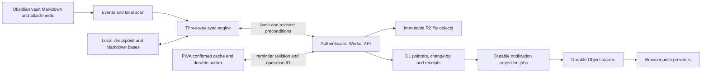

# Crate pre-release engineering audit

Candidate: **4b6c2911c62df31c08e656b44af76547b990e7be**, version **0.1.0**. Audit date: **September 8, 2026**. Scope: Obsidian plugin, sync protocol, Cloudflare deployment/backend, reminders domain, PWA, release process, and their shared failure boundaries.

## 1. Executive summary

**I would not approve this candidate for public release today. Readiness: 68/100.**

Crate has a sound underlying design and unusually substantial pre-release verification. It is much stronger than an ad hoc file uploader: immutable R2 objects, transactional D1 publication, hash and incarnation preconditions, three-way local reconciliation, durable reminder operation receipts, server-derived notification scheduling, privacy-aware authentication, and real Worker-runtime tests are implemented and exercised. The repository also contains useful architecture, protocol, deployment, recovery, and release documentation.

Nevertheless, fresh reproductions found **two BLOCKER and two CRITICAL issues**. A PWA authentication failure destroys edits that have never reached the server. Plugin reminder reordering can delete a Markdown block after a normal copy/paste. A temporary local discovery failure can authorize remote deletion. Resetting a connection can restore a checkpoint from the previous server. These are failures of critical invariants across otherwise reasonably defensive modules.

Six further HIGH findings affect stable reminder identity, deterministic dates, Markdown structure, filesystem namespace validity, notification registration, and disclosure of incomplete reminder lists. The key release work is to enforce those invariants at actual mutation and recovery boundaries, with integrated regressions. A large architectural rewrite would add risk without addressing the immediate causes.

**Fresh verification on this candidate:**

| Check | Result |
| --- | --- |
| Clean lockfile install | Passed using Node 24.19.0; the machine's default Node 23 is outside the declared range |
| `npm run release:check` | Passed, exit 0 |
| Lint, both TypeScript targets, dead-code checks, generated notices | Passed as part of the release gate |
| Unit suite | 196 files, **1,299 tests passed** |
| Local workerd/D1/R2 suite | 16 files, **98 tests passed** |
| Python recovery suite | **17 tests passed** |
| Chromium and WebKit PWA suites | Passed cache, focus, safety, optimistic saves, enrollment, updates, capacity and pagination checks |
| Production artifacts, CSS scope, bundle budgets, manifest/version validation | Passed |
| Additional visual typecheck and snapshots | **48 visual tests passed** |
| Dependency advisory audit | **Zero known advisories** at audit time |
| Gitleaks history and current-source scan | Passed; **456 commits** scanned |
| New audit reproductions | **16 assertion-of-bug tests**, plus five PWA scenarios in each of Chromium/WebKit, confirmed the findings described below |

Passing reproduction tests deliberately assert the faulty current outcome; they are evidence, not fixes. Sources and logs are preserved in [docs/audit-evidence/4b6c291/README.md](/Users/kaanbiryol/.codex/worktrees/bdfe/obsidian-crate/docs/audit-evidence/4b6c291/README.md). Temporary runnable tests were removed. No production code, deployment, remote vault, release, or Git commit was changed.

This audit traced implementations and callers, rather than accepting documentation or earlier audits as proof. It did **not** execute OAuth against an unrelated Cloudflare account, deploy to a live account, test actual Obsidian on physical iOS/Android, deliver real provider push notifications, or rehearse an independent-account hosted restore. Local runtime and browser tests do not establish those properties. The declared minimum Obsidian version and exact public release assets still require the repository's acceptance record.

Finding categories used below are **Confirmed bug**, **Architectural risk**, **Missing protection/test**, and **Optional improvement**. Confidence distinguishes reproduced behavior from downstream static inference. Severity follows the requested definitions; retained remote versions and local trash are credited as recovery protections, rather than ignored when assessing impact.

## 2. Release blockers

### F01 — Authentication failure destroys uncommitted PWA work

**Severity:** BLOCKER. **Confidence:** Confirmed. **Category:** Confirmed bug. **Area:** PWA authentication, durable mutations, data safety.

**Problem and impact:** An authenticated API response with status 401 invokes the same cleanup used for explicit logout. That cleanup deletes drafts and all durable pending commands. Fresh session replacement also invokes destructive cleanup. Unique text that never reached Cloudflare has no remote version or vault backup to recover.

**Failure sequence:**

1. A user saves a unique reminder title. The editor closes and the durable outbox contains the command.
2. The mutation returns 503 before committing. The PWA correctly retains an uncertain command and optimistic text.
3. The session expires or is revoked while the change is still unresolved. Browser sessions have a 90-day lifetime.
4. The next read/write returns 401. The unauthorized callback calls `clearLocalSession()`.
5. The token, drafts, and outbox entries are deleted. Re-enrollment cannot recover the unique text.

**Evidence:** Both Chromium and WebKit reproduced an uncertain command containing unique text becoming an empty outbox with a null token. The mutation was intercepted with a 503 before reaching the preview backend, then a list 401 was injected. Actual token expiry/revocation is a caller-traced trigger, not a real backend expiry test. Successful fresh-session replacement is a separate caller-traced loss path: it invokes the same cleanup directly, without requiring a later 401.

**Files/symbols:** `makeApiFetch` in [src/pwa/api.ts:54](/Users/kaanbiryol/.codex/worktrees/bdfe/obsidian-crate/src/pwa/api.ts:54); `clearLocalSession` and unauthorized callback in [src/pwa/hooks/usePwaSessionLifecycle.ts:66](/Users/kaanbiryol/.codex/worktrees/bdfe/obsidian-crate/src/pwa/hooks/usePwaSessionLifecycle.ts:66); replacement flow in [src/pwa/hooks/usePwaBootstrap.ts:82](/Users/kaanbiryol/.codex/worktrees/bdfe/obsidian-crate/src/pwa/hooks/usePwaBootstrap.ts:82); [src/pwa/reminder-outbox-storage.ts:132](/Users/kaanbiryol/.codex/worktrees/bdfe/obsidian-crate/src/pwa/reminder-outbox-storage.ts:132); TTL in [src/cloudflare/worker/notification-enrollment-handlers.ts:10](/Users/kaanbiryol/.codex/worktrees/bdfe/obsidian-crate/src/cloudflare/worker/notification-enrollment-handlers.ts:10).

**Root cause:** Credential invalidation and destruction of user-authored intent are coupled. Expired authority is treated as consent to discard unsynced data.

**Recommended change:** Invalidate requests and hide protected views on involuntary session failure, but preserve commands in a recovery store bound to the original deployment/folder. Re-enrollment into the same scope must allow review/export and receipt reconciliation before replay. Never replay into another scope. Explicit logout can retain its privacy cleanup with clear consequences for pending work.

**Tests proving the fix:** Expiration and fresh-link renewal with both uncommitted and committed-but-unacknowledged commands; 90-day offline boundary; two tabs and delayed requests; matching-scope recovery; different-scope refusal; explicit logout still clears private data across tabs and blocks late rehydration.

### F02 — Reordering can silently remove reminder Markdown

**Severity:** BLOCKER. **Confidence:** Confirmed. **Category:** Confirmed bug. **Area:** Obsidian reminder writer, concurrent editor changes.

**Problem and impact:** Reordering builds a map keyed by reminder ID and assumes uniqueness. When current Markdown has duplicate IDs, reconstruction can omit an entire block. Stable-ID repair happens later in a debounced scan; it is not enforced inside the atomic write. A deleted local-only block may never have existed remotely.

**Failure sequence:**

1. The index contains `Original(id=same)` and `Another(id=another)`.
2. The Markdown editor pastes a copy of Original and changes its text, retaining the invisible ID marker.
3. The watcher schedules its rescan for 1,500 ms later.
4. Before that scan, the user reorders the sidebar list. The real repository calls the writer, which reads the now-three-block file inside `vault.process`.
5. `activeById` keeps the last duplicate. Reconstruction emits that block once and excludes both duplicate entries from the remainder. Original disappears without an error.
6. The post-write rescan sees a valid two-block file; normal sync propagates the loss.

**Evidence:** Reproduced through the real repository → writer → atomic processing callback → index/scanner pipeline, not only the pure reorder helper. Backend reorder has stronger source-ownership checks; this finding concerns the plugin boundary.

**Files/symbols:** `reorderReminderBlocksInContent` in [src/reminders/core/markdownReminderFile.ts:237](/Users/kaanbiryol/.codex/worktrees/bdfe/obsidian-crate/src/reminders/core/markdownReminderFile.ts:237); [src/reminders/data/markdown-writer/reorder.ts:15](/Users/kaanbiryol/.codex/worktrees/bdfe/obsidian-crate/src/reminders/data/markdown-writer/reorder.ts:15); repository reorder in [src/reminders/data/reminder-repository/mutations.ts:105](/Users/kaanbiryol/.codex/worktrees/bdfe/obsidian-crate/src/reminders/data/reminder-repository/mutations.ts:105); watcher delay in [src/reminders/services/vaultWatcher.ts:103](/Users/kaanbiryol/.codex/worktrees/bdfe/obsidian-crate/src/reminders/services/vaultWatcher.ts:103).

**Root cause:** Eventual index uniqueness is used as a mutation-time precondition. The writer does not enforce conservation of current source blocks.

**Recommended change:** Validate uniqueness and the expected current order inside `vault.process`. Reject ambiguous reorders while preserving every byte. Preserve unknown/new blocks, and verify the input/output multiset of complete blocks is identical. Normalize ambiguous ownership separately, using current source data.

**Tests proving the fix:** Duplicate paste between scan and reorder; duplicated requested IDs; new, unknown, deleted and concurrently moved blocks; descriptions/children; property-based permutations asserting block conservation; real repository/index/writer integration.

### F03 — Temporary local discovery errors can delete remote files

**Severity:** CRITICAL. **Confidence:** Confirmed. **Category:** Confirmed bug. **Area:** Sync planning, local filesystem failure handling.

**Problem and impact:** `safeList` turns a failed folder listing into an empty listing; `safeStat` turns failure into absence. Full reconciliation considers undiscovered hidden files locally deleted and sends a legitimate, revision-guarded remote delete. A guard against remote concurrency cannot correct a false local premise.

**Failure sequence:**

1. `.private/note.md` exists locally and remotely with a shared hash and revision.
2. Full reconciliation runs, for example after an expired changelog cursor. The adapter temporarily fails to list `.private`, or to stat the note.
3. Discovery returns no file and no planner error. The file is absent from the local map but present in the base and remote maps.
4. `classifyPath` chooses remote deletion. `processDiff` calls the delete API without checking local existence.
5. Cloudflare deletes the live pointer. Other devices subsequently move their copies to trash.

**Evidence:** Separate list-failure and stat-failure tests exercised real discovery, planner, classifier and diff processing. Both produced a remote-delete call with `plan.errors=[]` although adapter existence was true. The API call was spied rather than sent to a hosted server; its acceptance follows the already-tested hash/revision delete contract.

**Files/symbols:** [src/sync/file-discovery.ts:197](/Users/kaanbiryol/.codex/worktrees/bdfe/obsidian-crate/src/sync/file-discovery.ts:197); `createFullSyncPlan` in [src/sync/planner-full.ts:15](/Users/kaanbiryol/.codex/worktrees/bdfe/obsidian-crate/src/sync/planner-full.ts:15); [src/sync/reconciliation.ts:67](/Users/kaanbiryol/.codex/worktrees/bdfe/obsidian-crate/src/sync/reconciliation.ts:67); delete branch in [src/sync/transfer-process.ts:145](/Users/kaanbiryol/.codex/worktrees/bdfe/obsidian-crate/src/sync/transfer-process.ts:145). Force-sync discovery uses the same incomplete result.

**Root cause:** The planner cannot distinguish verified absence from an incomplete filesystem snapshot.

**Recommended change:** Carry discovery completeness/errors and uncertain subtrees into planning. Do not infer deletions in an uncertain subtree; abort destructive force-sync when discovery is incomplete. Revalidate missing local paths before issuing remote deletes, treating adapter errors as uncertainty. Report the affected scope visibly.

**Tests proving the fix:** Root/nested hidden-folder listing failures, stat permission/transient failures, force-sync, fallback after cursor expiry, partial directory access, later successful recovery; assert zero remote deletions from uncertainty.

**Severity limit:** Remote versions remain recoverable for 30 days, and other-device local deletion uses trash. This is a confirmed incorrect destructive operation, not proof of immediate irrecoverable removal of every copy.

### F04 — Connection reset can recover the previous server's checkpoint

**Severity:** CRITICAL. **Confidence:** Confirmed checkpoint defect; High for the complete server-switch consequence traced through callers. **Category:** Confirmed bug. **Area:** Configuration transitions, checkpoint recovery.

**Problem and impact:** `deleteManifestFile` removes only the main checkpoint, ignores removal failures, and leaves the valid temporary generation. `LocalManifest.load` deliberately promotes that temporary file. Checkpoints contain no deployment identity. A supposedly fresh connection can therefore inherit the old server's common ancestor and interpret the new server's missing paths as remote deletions.

**Failure sequence:**

1. A checkpoint writes its valid temporary generation; writing the main generation fails, leaving the temporary file.
2. The user disconnects and connects to another server. Both reset paths remove only the main file and continue.
3. The new engine loads the remaining temporary checkpoint and restores old hashes/revisions.
4. The user selects normal Sync now to join the new server. For a local note unchanged from the stale base but absent on the new server, the classifier chooses `delete-local`.
5. Local notes move to trash instead of being treated as local creates. A failed main-file removal has the same stale-base problem.

**Evidence:** The real reset helper followed by a new `LocalManifest.load` restores the old revision. The configuration and classifier paths were independently reviewed. A live hosted server-switch was not performed.

**Files/symbols:** [src/sync/runtime-config.ts:11](/Users/kaanbiryol/.codex/worktrees/bdfe/obsidian-crate/src/sync/runtime-config.ts:11); connection/disconnect lifecycle in [src/sync/runtime.ts:239](/Users/kaanbiryol/.codex/worktrees/bdfe/obsidian-crate/src/sync/runtime.ts:239); checkpoint selection in [src/sync/manifest.ts:102](/Users/kaanbiryol/.codex/worktrees/bdfe/obsidian-crate/src/sync/manifest.ts:102); [src/sync/reconciliation.ts:57](/Users/kaanbiryol/.codex/worktrees/bdfe/obsidian-crate/src/sync/reconciliation.ts:57).

**Root cause:** Destructive reconfiguration assumes successful deletion of one file invalidates a multi-generation recovery protocol; the stored base is not scoped to its authority.

**Recommended change:** Scope checkpoints to deployment identity, quiesce outstanding saves before transition, and atomically invalidate/rotate all generations. Fail the configuration transition if old state cannot safely be invalidated. Preserve the old checkpoint for recovery without making it eligible for the new deployment.

**Tests proving the fix:** Failed main checkpoint write followed by disconnect/connect; failed removal; outstanding save completing after reset; switching to an empty and a different populated server; same-server reconnect; no unintended upload/delete and no old-generation recovery under new authority.

**Severity limit:** Local trash mitigates permanent loss. It does not make an unintended vault-wide removal acceptable.

## 3. Critical/high-priority findings

### F05 — A normal plugin project move changes the reminder's stable ID

**Severity:** HIGH. **Confidence:** Confirmed. **Category:** Confirmed bug. **Area:** Reminder identity and cross-client consistency.

**Problem and impact:** A successful project move refreshes destination and source concurrently. The destination scan reserves IDs from the stale source index and rewrites the moved reminder's ID. Stable IDs join PWA commands, revisions, links, source ownership and notification occurrence history; changing one turns a move into a different logical reminder.

**Failure sequence:** Index Task in Old.md → append it with its ID to New.md → remove it from Old.md → invoke destination rescan before source index removal → reserve the old ID → normalization assigns a new UUID → original identity disappears. The reminder text survives, but pending PWA operations reference an identity that no longer exists.

**Files/symbols:** Move refresh in [src/reminders/data/markdown-writer/update.ts:133](/Users/kaanbiryol/.codex/worktrees/bdfe/obsidian-crate/src/reminders/data/markdown-writer/update.ts:133); runtime callback in [src/reminders/runtime.ts:37](/Users/kaanbiryol/.codex/worktrees/bdfe/obsidian-crate/src/reminders/runtime.ts:37); reserved IDs in [src/reminders/data/reminder-index/index.ts:194](/Users/kaanbiryol/.codex/worktrees/bdfe/obsidian-crate/src/reminders/data/reminder-index/index.ts:194); [src/reminders/data/vaultScanner.ts:75](/Users/kaanbiryol/.codex/worktrees/bdfe/obsidian-crate/src/reminders/data/vaultScanner.ts:75).

**Root cause:** A stale derived index authorizes rewriting source identity during a multi-file operation. **Recommended change:** Commit a coherent logical ownership transition and refresh the affected files together; source-first serialized refresh is the minimum local repair. Verify the supposed other owner against current Markdown before changing an ID. Address incoming PWA/server moves and interrupted two-file writes at the same boundary.

**Tests proving the fix:** Real writer/index/scanner move A→B and B→A; both rescan orders; delayed reads; recurring/completed reminders; remote-origin move downloaded destination-first; crash between destination and source writes. **Evidence:** The integrated move reproduction loses `stable-id` while retaining one reminder with a new ID.

### F06 — Persisted relative dates change meaning without a content change

**Severity:** HIGH. **Confidence:** Confirmed. **Category:** Confirmed bug. **Area:** Reminder dates, PWA revisions, notification projection.

**Problem and impact:** Natural-language parsing uses the current clock each time persisted Markdown is decoded. Adoption adds an ID but leaves `tomorrow` relative. The same file hash can therefore describe different reminders, breaking cache, revision and scheduling invariants. Zone-less timed text also depends on the reader's host timezone.

**Failure sequence:** Commit `Send invoice tomorrow` on September 8 → cached list reports September 9 with revision R → on September 9 unchanged conditional GET returns 304 and unconditional GET still returns the cached September 9/R → update re-reads identical source but parses September 10 → revision check rejects R with 409. Refresh cannot repair the unchanged cache. Separately, a first notification projection delayed across midnight derives a different due key and fails source verification even while the original deadline is still in the future.

**Files/symbols:** Clock-dependent parsing in [src/reminders/utils/reminderParser.ts:100](/Users/kaanbiryol/.codex/worktrees/bdfe/obsidian-crate/src/reminders/utils/reminderParser.ts:100) and [src/reminders/utils/reminderParser.ts:113](/Users/kaanbiryol/.codex/worktrees/bdfe/obsidian-crate/src/reminders/utils/reminderParser.ts:113); adoption in [src/reminders/data/vaultScanner.ts:80](/Users/kaanbiryol/.codex/worktrees/bdfe/obsidian-crate/src/reminders/data/vaultScanner.ts:80); cache/list in [src/cloudflare/worker/reminders-web/routes/list.ts:18](/Users/kaanbiryol/.codex/worktrees/bdfe/obsidian-crate/src/cloudflare/worker/reminders-web/routes/list.ts:18); source due keys in [src/cloudflare/worker/notification-projection-queue.ts:8](/Users/kaanbiryol/.codex/worktrees/bdfe/obsidian-crate/src/cloudflare/worker/notification-projection-queue.ts:8); projection validation in [src/cloudflare/worker/notification-projection.ts:33](/Users/kaanbiryol/.codex/worktrees/bdfe/obsidian-crate/src/cloudflare/worker/notification-projection.ts:33).

**Root cause:** Draft interpretation and authoritative persisted decoding share a clock-dependent parser, while persistence assumes file bytes determine domain state.

**Recommended change:** Resolve dates/recurrence once at adoption or editing, using an explicit timezone, and persist canonical calendar/instant metadata while preserving prose. Make durable decoding independent of current time and ambient timezone. Define how existing relative source is adopted; merely invalidating the cache each day would move the deadline rather than preserve user intent.

**Tests proving the fix:** Identical bytes parsed on successive days and in UTC/Berlin/Honolulu/Tokyo; cached versus freshly computed revisions; projection spanning midnight; DST gaps/folds; zone-less text; recurrence progress. **Evidence:** Pure parser reproduction plus two real Worker/D1/R2 tests confirmed the stale-cache 409 and failed delayed projection.

### F07 — Code examples become live reminders and reorder changes Markdown structure

**Severity:** HIGH. **Confidence:** Confirmed. **Category:** Confirmed bug. **Area:** Markdown parsing and source preservation.

**Problem and impact:** Adoption and scanning recognize checkbox-shaped lines without tracking fenced-code context. Reorder moves checkbox blocks while leaving fence lines fixed. Merely enabling reminders can modify an example, and reordering can move a real task inside a code fence.

**Failure sequence:** A reminder note contains a fenced Markdown checkbox example followed by a real task → normalization assigns an ID inside the fence → both appear in the list → reorder the real task before the example → the real task moves inside the fence and the example becomes ordinary rendered Markdown. Dates inside examples can also acquire reminder behavior.

**Files/symbols:** [src/reminders/data/vaultScanner.ts:67](/Users/kaanbiryol/.codex/worktrees/bdfe/obsidian-crate/src/reminders/data/vaultScanner.ts:67); [src/reminders/core/markdownScan.ts:52](/Users/kaanbiryol/.codex/worktrees/bdfe/obsidian-crate/src/reminders/core/markdownScan.ts:52); block extraction/reassembly in [src/reminders/core/markdownReminderFile.ts:199](/Users/kaanbiryol/.codex/worktrees/bdfe/obsidian-crate/src/reminders/core/markdownReminderFile.ts:199).

**Root cause:** A line regex is being used as a document model; movable block boundaries omit relevant Markdown structure. **Recommended change:** Share a document-aware task scanner across adoption, indexing and writing. A small fence/context state machine may suffice; a full Markdown AST is not automatically necessary. Preserve children and supporting prose, restrict reorders to compatible sections, or reject unsupported structures with an explanation.

**Tests proving the fix:** Backtick/tilde fences, indented code, headings, nested tasks/descriptions, supporting paragraphs, checkbox-like inline code; verify bytes outside supported task blocks and section associations remain unchanged. **Evidence:** Normalization → scan → reorder reproduction changed fence membership.

### F08 — The server accepts a filesystem namespace no client can represent

**Severity:** HIGH. **Confidence:** Confirmed. **Category:** Confirmed bug. **Area:** Backend path publication and distributed convergence.

**Problem and impact:** Whole-path uniqueness does not prevent a live file from also being the ancestor of another file. The server and shared validator accept both `Projects.md` and `Projects.md/child.md`. Neither a normal POSIX nor Windows filesystem can materialize both. Acknowledged uploads can leave all devices unable to converge.

**Failure sequence:** A creates the note `Projects.md`; B independently creates a directory named `Projects.md` with `child.md` → both upload with expected absence → both receive 200, in either order or concurrently → a fresh C can create one side but fails to create the other. Retries cannot resolve the namespace conflict.

**Files/symbols:** `uploadMutation` in [src/cloudflare/worker/sync-mutations.ts:15](/Users/kaanbiryol/.codex/worktrees/bdfe/obsidian-crate/src/cloudflare/worker/sync-mutations.ts:15); [src/cloudflare/schema.sql:19](/Users/kaanbiryol/.codex/worktrees/bdfe/obsidian-crate/src/cloudflare/schema.sql:19); another insertion path in [src/cloudflare/worker/atomic-markdown-write.ts:19](/Users/kaanbiryol/.codex/worktrees/bdfe/obsidian-crate/src/cloudflare/worker/atomic-markdown-write.ts:19); [src/protocol/portable-path.ts:28](/Users/kaanbiryol/.codex/worktrees/bdfe/obsidian-crate/src/protocol/portable-path.ts:28); local parent creation in [src/sync/local-apply.ts:114](/Users/kaanbiryol/.codex/worktrees/bdfe/obsidian-crate/src/sync/local-apply.ts:114).

**Root cause:** Flat object-key rules are insufficient for a hierarchical portable namespace. **Recommended change:** Enforce absence of ancestor/descendant file conflicts within the same transaction that publishes pointers, including canonical case/Unicode paths. Cover upload, batch, restore and reminder destination creation. Return a typed conflict and preserve the losing local file. A separate preflight SELECT alone still races.

**Tests proving the fix:** Ancestor-first, descendant-first, simultaneous, case/Unicode prefixes, batch and restore paths; exactly one conflicting publication succeeds, no loser effects leak, and a realistic third-device filesystem can apply the result. **Evidence:** Three real workerd/D1/R2 reproductions accepted both files. Their bytes remained readable; silent byte loss was not demonstrated.

### F09 — Push shows enabled when the server has no current subscription

**Severity:** HIGH. **Confidence:** Confirmed registration-failure behavior; High for renewal consequence traced across frontend/backend. **Category:** Confirmed bug. **Area:** Notification enrollment and session ownership.

**Problem and impact:** `refreshPushState` treats browser `PushManager.getSubscription()` as proof of a valid server registration. It displays On and hides Enable without verifying current-session ownership in D1. Reminders can stop notifying indefinitely while the UI reports success.

**Failure sequence A:** Browser subscribe succeeds → POST to register it returns 503 → browser subscription survives → resume refresh checks only browser state → On appears, Enable disappears, and no registration retry occurs. **Sequence B:** Session renewal deletes the old session's D1 push rows but leaves the browser subscription → new session refresh again reports On without attaching it.

**Files/symbols:** [src/pwa/hooks/usePushNotifications.ts:32](/Users/kaanbiryol/.codex/worktrees/bdfe/obsidian-crate/src/pwa/hooks/usePushNotifications.ts:32); enable flow in the same file; [src/pwa/components/SettingsSheet.tsx:164](/Users/kaanbiryol/.codex/worktrees/bdfe/obsidian-crate/src/pwa/components/SettingsSheet.tsx:164); [src/pwa/hooks/usePwaBootstrap.ts:82](/Users/kaanbiryol/.codex/worktrees/bdfe/obsidian-crate/src/pwa/hooks/usePwaBootstrap.ts:82); [src/cloudflare/worker/notification-enrollment-handlers.ts:64](/Users/kaanbiryol/.codex/worktrees/bdfe/obsidian-crate/src/cloudflare/worker/notification-enrollment-handlers.ts:64).

**Root cause:** Browser subscription, permission and server authorization are distinct states collapsed into one boolean. **Recommended change:** Reconcile an existing browser subscription with the authenticated server on bootstrap/resume/renewal. Show enabled only after confirmation; expose retry/repair when registration is unknown. Respect provider permission and ownership constraints.

**Tests proving the fix:** Registration fails before commit, response lost after commit, replacement session, changed permissions, provider endpoint rotation, restored backend without rows, real mobile delivery. **Evidence:** Both-engine PWA tests used a controlled PushManager and failed registration; each showed one attach attempt, On, and no Enable action. Real push-provider delivery was not claimed.

### F10 — Incomplete reminder lists look like a healthy empty workspace

**Severity:** HIGH. **Confidence:** Confirmed. **Category:** Confirmed bug. **Area:** PWA partial results, recovery UX.

**Problem and impact:** The backend intentionally omits unsafe or oversized reminder sources and returns structured issues. The PWA stores those issues in `error`, then sets the mode to live, whose notices are suppressed. A partial snapshot can be cached without its issue metadata. Users cannot distinguish missing reminders from a genuinely empty inbox.

**Failure sequence:** Oversized or duplicate-ID source is committed → list responds 200 with omitted reminders plus path/reason issues → frontend replaces the list, marks it live → UI shows Your inbox is empty / Add a new reminder, with no warning. Offline reuse of that snapshot also lacks the explanation.

**Files/symbols:** [src/cloudflare/worker/reminders-web/routes/list.ts:49](/Users/kaanbiryol/.codex/worktrees/bdfe/obsidian-crate/src/cloudflare/worker/reminders-web/routes/list.ts:49); [src/pwa/hooks/useReminderSync.ts:124](/Users/kaanbiryol/.codex/worktrees/bdfe/obsidian-crate/src/pwa/hooks/useReminderSync.ts:124); [src/pwa/hooks/usePwaStatus.ts:19](/Users/kaanbiryol/.codex/worktrees/bdfe/obsidian-crate/src/pwa/hooks/usePwaStatus.ts:19); [src/pwa/components/PwaChrome.tsx:64](/Users/kaanbiryol/.codex/worktrees/bdfe/obsidian-crate/src/pwa/components/PwaChrome.tsx:64); cached shape in [src/pwa/types.ts:75](/Users/kaanbiryol/.codex/worktrees/bdfe/obsidian-crate/src/pwa/types.ts:75).

**Root cause:** Freshness/transport success and completeness are represented as one state. **Recommended change:** Persist structured issues separately from network errors, render a persistent partial-data notice with affected sources and recovery actions, and keep healthy reminders usable. Do not present a complete-empty message for an incomplete dataset.

**Tests proving the fix:** Mixed/all-omitted sources, actual oversized and duplicate-ID backend responses, cache reload/offline, repair clears notice, accessible announcement and recovery controls. **Evidence:** Both real PWA browser engines showed the empty inbox with zero visible issue text for an injected partial 200 response.

### Other material findings

**F11 — Metadata-only discovery can miss edits indefinitely. Severity: MEDIUM. Confidence: Confirmed. Category: Confirmed bug under a specific filesystem condition. Area: Sync change detection.** If an external restore/tool changes bytes while preserving size and modification time while Crate is stopped, periodic detection, incremental local discovery and even full reconciliation reuse the old hash. The local edit can remain only on that device while status reports Synced. Atomic apply guards still prevent a later remote write from blindly overwriting those bytes; this is not evidence of that overwrite. Files: [src/sync/local-file-changes.ts:23](/Users/kaanbiryol/.codex/worktrees/bdfe/obsidian-crate/src/sync/local-file-changes.ts:23), [src/sync/planner-local.ts:37](/Users/kaanbiryol/.codex/worktrees/bdfe/obsidian-crate/src/sync/planner-local.ts:37), [src/sync/planner-full.ts:21](/Users/kaanbiryol/.codex/worktrees/bdfe/obsidian-crate/src/sync/planner-full.ts:21). Root cause: size/mtime are treated as conclusive identity. Change: provide a genuine full content-verification pass and invalidate fingerprints on uncertain/restored state; keep cheap metadata checks for ordinary polling. Tests: same-size/mtime restoration, restart, hidden files, coarse timestamps, and eventual bounded rehash. The audit reproduced all three paths returning no changes without reading the changed content.

**F12 — A valid partial update clears an omitted description. Severity: MEDIUM. Confidence: Confirmed. Category: Confirmed bug. Area: Reminder API/repository patch semantics.** A caller updates only priority on a reminder with description metadata; `buildReminderUpdate` adds `description: undefined`; the block builder tests property presence and removes the description. Files: [src/reminders/data/reminder-repository/shared.ts:119](/Users/kaanbiryol/.codex/worktrees/bdfe/obsidian-crate/src/reminders/data/reminder-repository/shared.ts:119), [src/reminders/core/markdownReminderMutation.ts:115](/Users/kaanbiryol/.codex/worktrees/bdfe/obsidian-crate/src/reminders/core/markdownReminderMutation.ts:115), [src/cloudflare/worker/reminders-web/routes/update.ts:34](/Users/kaanbiryol/.codex/worktrees/bdfe/obsidian-crate/src/cloudflare/worker/reminders-web/routes/update.ts:34). Root cause: absent and explicitly cleared fields are conflated. Change: preserve property presence using conditional construction, with an explicit clearing representation. Tests: every single-field patch preserves all omitted fields; explicit clear, project-only move and protocol round trips. Production helpers reproduced the deletion. Current plugin/PWA full-form saves supply description, so this is a bounded public-contract defect rather than a claim that every current UI save loses descriptions.

**F13 — Acknowledged changes revert visually in another tab. Severity: MEDIUM. Confidence: Confirmed. Category: Confirmed bug. Area: PWA multi-tab convergence.** Both visible tabs overlay a shared pending command. The Web-Lock winner alone commits the confirmed result; removing the command makes the other tab expose its old base list. Either tab can win, so the originating tab can also appear to roll back. Files: [src/pwa/hooks/useReminderOutbox.ts:53](/Users/kaanbiryol/.codex/worktrees/bdfe/obsidian-crate/src/pwa/hooks/useReminderOutbox.ts:53), [src/pwa/hooks/useReminderOutbox.ts:86](/Users/kaanbiryol/.codex/worktrees/bdfe/obsidian-crate/src/pwa/hooks/useReminderOutbox.ts:86), [src/pwa/reminder-outbox.ts:67](/Users/kaanbiryol/.codex/worktrees/bdfe/obsidian-crate/src/pwa/reminder-outbox.ts:67), [src/pwa/reminder-optimistic-state.ts:39](/Users/kaanbiryol/.codex/worktrees/bdfe/obsidian-crate/src/pwa/reminder-optimistic-state.ts:39). Root cause: command ownership is synchronized but committed state is not invalidated across tabs. Change: broadcast scoped committed revisions/results or revalidate on external settlement, with read/session fencing. Tests: two/three visible windows, both lock winners, all mutation kinds and overlapping stale reads, convergence without focus/reload. Both browser engines reproduced stale visible state after acknowledgement. Server revisions protect storage from a subsequent stale overwrite.

**F14 — Today/Upcoming can remain yesterday after midnight. Severity: MEDIUM. Confidence: Confirmed. Category: Confirmed bug. Area: Time-sensitive UI.** Open Today just before midnight with a task due tomorrow; after midnight it still reports zero. An unchanged 304 refresh updates freshness without invalidating the reminder-array-based memo. Files: [src/reminders/ui/views/TodayView.tsx:41](/Users/kaanbiryol/.codex/worktrees/bdfe/obsidian-crate/src/reminders/ui/views/TodayView.tsx:41), [src/reminders/ui/views/UpcomingView.tsx:48](/Users/kaanbiryol/.codex/worktrees/bdfe/obsidian-crate/src/reminders/ui/views/UpcomingView.tsx:48), [src/pwa/components/PwaRemindersAppShell.tsx:96](/Users/kaanbiryol/.codex/worktrees/bdfe/obsidian-crate/src/pwa/components/PwaRemindersAppShell.tsx:96), [src/pwa/hooks/useReminderSync.ts:109](/Users/kaanbiryol/.codex/worktrees/bdfe/obsidian-crate/src/pwa/hooks/useReminderSync.ts:109). Root cause: time and timezone are implicit selector inputs. Change: pass an explicit clock/day key, updating at relevant boundaries, resume and timezone change. Tests: midnight plus 304, timed deadlines, DST 23/25-hour days, prolonged suspension, shared plugin views. Both browsers reproduced midnight staleness; Chromium also reproduced staleness after 304. Remounting or receiving changed data can recover the view; reminder storage is not lost.

**F15 — A committed deletion cannot reliably be attributed after the fact. Severity: MEDIUM. Confidence: Confirmed implementation gap. Category: Missing protection/test. Area: Observability.** Two devices delete several files in the same second. Changelog/retained versions identify paths, while logs identify requests/devices, but deleted revisions and request identity do not join those records. Successful delete logs have `revisions: []`. Files: [src/cloudflare/worker/sync-mutations.ts:124](/Users/kaanbiryol/.codex/worktrees/bdfe/obsidian-crate/src/cloudflare/worker/sync-mutations.ts:124), [src/cloudflare/worker/request-diagnostics.ts:8](/Users/kaanbiryol/.codex/worktrees/bdfe/obsidian-crate/src/cloudflare/worker/request-diagnostics.ts:8), [src/cloudflare/schema.sql:7](/Users/kaanbiryol/.codex/worktrees/bdfe/obsidian-crate/src/cloudflare/schema.sql:7). Root cause: correlation is added after commit and extracted from responses that omit deletion revisions. Change: persist validated request/session/device IDs and the consumed revision with the committed change; return its sequence/identifier, with no note body or credentials in logs. Tests: concurrent batched deletes, lost acknowledgement, failed CAS, retries, and privacy assertions. This makes a serious user report harder to investigate; it does not itself delete data.

**F16 — Malformed reminder metadata blocks generic file sync. Severity: MEDIUM. Confidence: Confirmed. Category: Confirmed bug. Area: Backend responsibility boundary and error classification.** With no notification policy configured, upload an ordinary note outside the reminders folder containing a valid reminder ID and malformed description encoding such as `crate-desc:v1:%invalid`. R2 staging succeeds, but synchronous reminder parsing throws while preparing D1 commit effects; upload returns 503 and no live file row is published. Repeated retries cannot fix the source. Files: [src/cloudflare/worker/notification-projection-queue.ts:5](/Users/kaanbiryol/.codex/worktrees/bdfe/obsidian-crate/src/cloudflare/worker/notification-projection-queue.ts:5), [src/reminders/core/markdownReminderFile.ts:34](/Users/kaanbiryol/.codex/worktrees/bdfe/obsidian-crate/src/reminders/core/markdownReminderFile.ts:34), [src/cloudflare/worker/sync-file-handlers.ts:89](/Users/kaanbiryol/.codex/worktrees/bdfe/obsidian-crate/src/cloudflare/worker/sync-file-handlers.ts:89). Root cause: acceptance of opaque vault bytes depends on optional domain parsing. Change: publish valid file bytes while atomically quarantining a failed projection; expose a source issue and never derive cancellation from an uncertain parse. Tests: malformed/unsupported description and recurrence metadata, no policy, outside-folder files, exact-byte download and successful repair/reprojection. A real Worker/D1/R2 test reproduced the 503. Local and previous remote bytes remain safe, limiting severity.

The remaining evolution, capacity and physical-device concerns below are **architectural risks or missing validation**, not additional confirmed data-loss bugs.

## 4. Sync correctness assessment

### Actual lifecycle and authority

The plugin entry delegates lifecycle to [src/plugin/CratePlugin.ts](/Users/kaanbiryol/.codex/worktrees/bdfe/obsidian-crate/src/plugin/CratePlugin.ts) and [src/plugin/lifecycle.ts](/Users/kaanbiryol/.codex/worktrees/bdfe/obsidian-crate/src/plugin/lifecycle.ts). The sync runtime owns configuration, foreground/startup behavior, status and activity. The engine composes planning, queueing, transfer, checkpoints, merge bases and conflicts. Files in the vault are local source data; the local manifest represents the last common remote content, not an authoritative remote replica by itself.

The PWA does not sync complete vault files. It submits scoped reminder commands. The Worker reloads the committed Markdown, checks reminder/domain and file versions, transforms source, stages immutable objects, and publishes the new pointers and operation receipt transactionally. The plugin subsequently receives an ordinary file change. This makes the Markdown domain the principal cross-client contract.

1. **Connect/bootstrap:** OAuth provisions or discovers the deployment and registers the device. Configuration initializes the engine with startup sync skipped. For a fresh server, initial upload is explicit. Joining uses normal reconciliation. The initial-upload workflow streams byte-budgeted preparation batches; it is not a remote-clearing operation. Force full sync is a separate confirmed local-authoritative operation that stops before remote deletion if uploads fail.
2. **Local changes:** Registered create/modify/delete/rename events feed a debounced in-memory queue. Per-path queue generations keep a new event from being removed by completion of an older operation. A rename is upload-new-path plus delete-old-path; it has no file identity or atomic rename operation. Folder changes rely on discovery when individual event coverage is incomplete.
3. **Remote changes:** Incremental reconciliation pages the changelog after `lastSeq`, retains the latest event per path, scans local changes/deletes, and uses the same `classifyPath` policy as full sync. Expired cursors fall back to a paginated manifest plus change reconciliation. Failed/partial application does not intentionally advance the cursor past unprocessed work.
4. **Publication:** Uploaded bytes are bounded and SHA-256 verified, then written to a fresh R2 key. D1 compare-and-swap publishes the pointer with changelog, retained version, source/projection changes and, for reminder commands, receipts. A multi-file reminder move has a dedicated atomic D1 transaction; ordinary file batches commit individual files independently.
5. **Local application:** Downloads validate size and hash against the planned remote version. Existing supported text is compared again inside `Vault.process` or adapter processing before replacement. Unsafe binary replacement produces a content-addressed incoming review copy. Conflicting text can be three-way merged or preserved in a conflict copy. Remote deletions re-read local content and use vault-local trash, including the bytes present in a late deletion race.
6. **Checkpoint/recovery:** Manifest writes serialize temporary and main generations; load selects the newest valid generation and refuses an entirely invalid checkpoint. Applied-content metadata is revalidated, otherwise marked unverified. Common Markdown bases are stored separately and can be rebuilt when current bytes match the baseline. F03/F04 expose gaps in snapshot completeness and reconfiguration around those safeguards.

See [src/sync/engine-standard-sync-workflow.ts](/Users/kaanbiryol/.codex/worktrees/bdfe/obsidian-crate/src/sync/engine-standard-sync-workflow.ts), [src/sync/planner-incremental.ts](/Users/kaanbiryol/.codex/worktrees/bdfe/obsidian-crate/src/sync/planner-incremental.ts), [src/sync/worker-api/sync.ts](/Users/kaanbiryol/.codex/worktrees/bdfe/obsidian-crate/src/sync/worker-api/sync.ts), [src/sync/local-apply.ts](/Users/kaanbiryol/.codex/worktrees/bdfe/obsidian-crate/src/sync/local-apply.ts), and [src/cloudflare/worker/sync-mutations.ts](/Users/kaanbiryol/.codex/worktrees/bdfe/obsidian-crate/src/cloudflare/worker/sync-mutations.ts).

### Multi-device outcomes

| Scenario | What the current implementation does | Assessment |
| --- | --- | --- |
| A and B edit disjoint Markdown regions offline | First upload wins its CAS; the second uses the common base to merge, uploads against the current remote hash, and rechecks local bytes before applying | Selected three-device/restart sequences verified in real runtime tests |
| A and B replace the same word/structured region | Merge refuses unsafe overlap; local text is preserved as a conflict copy and remote text becomes the main file where safe | Content preservation is stronger than semantic automatic resolution; user review remains necessary |
| Both insert different lines at the same location | Line merge uses deterministic ordering; unsafe competing inline insertions can be rejected | Content may be preserved in an order neither writer explicitly selected; this is merge policy, not chronological intent |
| A edits, B deletes; either arrival order | Edited content wins: local edit is re-uploaded against remote absence, or remote edit is restored instead of applying stale deletion | Both orders have real multi-engine tests; resurrection is intentional and recorded as an edit/delete race |
| A renames, B edits the original | New path retains A's content; the edited original is retained/recreated | Two paths are the designed result; real-runtime test verifies both |
| A and B rename the same source differently | Each destination is a separate create; old-path deletion is idempotent. Both destinations survive | Traced outcome; no file-identity model to join these moves. Add a dedicated integrated test |
| A deletes, B recreates with identical bytes | The recreated file has a new storage-key revision. A stale delete with the old revision cannot remove it | Real runtime regression exists |
| A upload commits but its response is lost | Retry compares current content, validates the stored bytes and can acknowledge the identical result; later reconciliation repairs the client checkpoint | Commit-safety and engine-restart tests cover representative cases |
| A edits again while an auto-merge upload is in flight | Local atomic precondition defers replacement; the intermediate local snapshot is retained as a virtual base to avoid blindly applying stale merged bytes | Targeted transfer tests; broader randomized histories still needed |
| PWA writes stale data after plugin changed that reminder | Expected reminder revision rejects the command; an operation receipt handles a committed retry | Canonical-data backend tests are strong; F01/F05/F06 break recovery, identity or deterministic revision assumptions |
| PWA and plugin edit different reminders in one note | File CAS prevents an obsolete whole-note write; reminder mutation must retry/reload rather than clobber unrelated content | Correct boundary; test combinations with moves and relative source |
| Two PWA tabs act concurrently | Shared lock avoids simultaneous drain; server revisions and receipts constrain duplicate effects | Confirmed-state broadcasting is missing (F13) |
| Device returns after weeks offline | Expired changelog cursor triggers full three-way reconciliation using local base; versions older than 30 days may no longer be recoverable | Reasonable sync recovery, bounded backup recovery; F03 becomes especially relevant during fallback |
| Client crashes midway through remote application | Applied files remain; incomplete durable checkpoints lead to reclassification, duplicate downloads or conflict preservation on restart | Several checkpoints/interruption boundaries tested; arbitrary OS kill and filesystem errors are not fully covered |
| Backend fails between R2 staging and D1 publication | Unpublished object remains an orphan; published pointer is authoritative. Uncertain commit errors do not immediately reclaim possibly live objects | Appropriate design, with real failure injection |
| A file and a descendant are created on different devices | Both publications succeed but no normal client filesystem can apply both | F08 breaks eventual convergence |

### Critical invariants and enforcement

| Invariant | Current enforcement | Remaining gap |
| --- | --- | --- |
| Every live file pointer refers to verified bytes | Hash/size validation, fresh R2 staging, guarded D1 publication, recovery tests | Operational corruption can still require restore; do not infer healthy storage merely from reachable manifest |
| A stale delete cannot remove a new incarnation | D1 hash + storage-key predicate | Local absence premise can be false (F03), or base can belong to another server (F04) |
| Every live path is representable on supported filesystems | Portable full-path validation and unique normalized path | Ancestor constraints missing (F08) |
| Local user edits are rechecked at overwrite time | Atomic text callbacks; binary review copies; trash for deletion | Metadata shortcuts miss some edits (F11); local multi-file moves are not crash-atomic |
| Reminder reorder conserves source content | Atomic callback exists | Content conservation/uniqueness absent (F02/F07) |
| Reminder ID survives a move | Marker copied by writer, backend source identity tracked | Plugin index repair changes it (F05) |
| Same persisted bytes imply same domain and revision | Shared parser and file-hash cache | Current time/host timezone influence decoding (F06) |
| Every accepted semantic command applies once | D1 operation receipt, request hash, identity constraints, transaction effects | External push is not exactly-once; browser intent can be erased before acceptance (F01) |
| Auth invalidation cannot erase unacknowledged intent involuntarily | No separate recovery state | F01 |
| A partial result cannot claim completeness | Server returns per-source issues | PWA hides them (F10) |
| Derived reminder failures cannot reject unrelated file bytes | Projection is normally asynchronous after commit | Initial source extraction throws before commit (F16) |

There is no evidence here for recommending a CRDT conversion. The present optimistic concurrency and three-way merge design can meet this product's needs once these invariants are enforced consistently.

## 5. Sync threat model

The central assets are local note bytes, remote current/retained bytes, stable reminder identity, unresolved browser commands, and the user's ability to tell which data is authoritative. Expected threats include ordinary concurrent edits, OS interruptions, corrupt local state, stale clients, service outages, and malicious requests from outside the deployment's authority.

| Dangerous outcome | Current protection | Remaining exposure |
| --- | --- | --- |
| Newer remote data overwritten by stale client | Conditional hash publication; reminder revisions; conflict preservation | Hash-equivalent content incarnations are treated alike for uploads; no new byte-loss case confirmed from that alone |
| Local changes overwritten during download | Byte validation and atomic text compare; binaries preserved for review | Size/mtime blind spot leaves some changes undiscovered, but write guards still defend bytes |
| Local-only reminder text lost | Durable outbox; guarded ordinary Markdown mutations | F01 and F02 are direct, reproduced loss paths |
| Incorrect remote deletion | Revision-guarded deletes, 30-day retained versions | F03 misclassifies I/O uncertainty as deletion |
| Incorrect local deletion | Current-byte check and forced trash | F04 can apply an old deployment's base to a new server |
| Metadata corrupted while content looks valid | Stable IDs, source ownership, parser cache version | F05 changes identity; F06 changes date/revision without byte changes |
| Reminder duplicated | UUID markers, backend duplicate-owner quarantine, idempotent create receipts | Process death during plugin two-file move can leave both copies; later normalization can give the duplicate a new ID |
| Deleted content resurrected | Delete revisions and explicit edit/delete policy | Concurrent edits intentionally win over deletion; rename/edit creates two paths. Users need the recorded race explanation |
| Devices diverge forever | Unified classifier, retries, cursor fallback | F08 impossible namespace; unresolved binary conflicts need user action; F06 can leave persistent reminder conflicts |
| PWA diverges from Obsidian | Same committed Markdown, scoped revision checks | F05/F06; PWA can stay stale while continuously visible; F13 omits cross-tab confirmed updates |
| A command applies twice | Receipt commits atomically with source mutation; exact request replay | External push acceptance and delivery checkpoint cannot share a transaction; crash after provider acceptance can repeat an alert |
| A command is skipped | Pending commands persist; cursor advances only on resolved transfer work | F01 erases unresolved commands; F09 leaves no server push recipient; F10 hides omitted sources |
| Partial server commit corrupts bytes | Immutable staging and D1 transactional publication; dedicated two-file reminder move | Ordinary sync batches/renames are intentionally not global transactions |
| Long-offline recovery becomes impossible | Common bases, full manifest fallback, trash/conflict copies, paired backups | Retention is finite; browser-only text never committed has no remote backup; corrupted outbox needs a recovery/export path |
| Untrusted party accesses another folder/vault | Deployment isolation, hashed credentials, scoped PWA routes, delivery-time authorization | No cross-user/folder access was confirmed; account/device compromise remains within the stated trust model |

The system must prefer an actionable conflict or incomplete-state warning to destructive inference. The most valuable proof obligations are conservation of current bytes, explicit authority changes, and durable intent survival.

## 6. Architecture assessment

The main responsibility split is appropriate: plugin filesystem integration and planning; shared domain transforms; Worker authorization and publication; R2 bytes; D1 authoritative metadata and receipts; Durable Object scheduling; PWA local cache/intent. There is no need to add KV, WebSockets, Cloudflare Queues or another database merely for architectural symmetry.

Shared modules are already a strength. The classifier avoids different full/incremental merge policies. The reminders core is reused instead of maintaining separate completion/recurrence implementations for each client. Narrow context interfaces enable good failure injection without running Obsidian. Tests that compose those real modules, however, find defects that isolated mocked callbacks miss.

The practical structural changes are:

| Boundary to improve | Concrete change | Benefit and what should remain together |
| --- | --- | --- |
| Local snapshot completeness | Introduce an explicit scan result with files, uncertain paths/subtrees and errors; centralize deletion eligibility | Prevents F03 without rewriting the planner; keep classification and transfer orchestration separate |
| Persisted versus draft reminder parsing | Separate canonical durable decoding from NLP draft/adoption interpretation | Enforces byte→domain determinism (F06); retain shared recurrence/date primitives |
| Markdown task block model | One context-aware scanner/block representation shared by adoption, index and writers | Stops fence edits and enables reorder conservation; keep mutation-specific revision guards |
| Identity ownership transitions | Make multi-file move/index refresh a coherent operation; verify actual owners before ID repair | Fixes F05 and improves crash recovery; avoid treating every rescan as a global authoritative mutation |
| Session recovery versus logout | Isolate scope-bound pending-work recovery from credential cleanup | Preserves privacy and F01 intent; keep request-generation fencing |
| Hierarchical path contract | Shared normalized namespace rules, enforced transactionally on the server | Fixes F08 across all publication paths rather than only one handler |
| Confirmed versus tentative PWA state | Cross-tab committed revision invalidation and an independent partial-data state | Fixes F10/F13 while retaining the existing durable outbox |

The largest production modules include the 487-line sync engine, 465-line rich text input, 436-line PWA entry, 422-line sync runtime and 354-line alarm implementation. Size alone is not a finding. Splitting them purely to satisfy a line-count target would scatter state-machine invariants. Keep short state transitions together; extract genuinely shared protocol/ownership rules where the above failures show a need.

Hidden ambient state worth making explicit is the wall clock/timezone in reminder decoding, derived reminder ownership during rescans, deployment identity in checkpoints, and the session generation used by asynchronous PWA operations. The per-vault D1 primary and notification coordinator remain availability/throughput concentration points; that is reasonable for self-hosted single-vault deployments, but hosted capacity must be measured.

## 7. Cloudflare/backend assessment

**The chosen primitives are appropriate.** D1 is the authoritative publication boundary; R2 objects are immutable and read by binding; Durable Objects hold reminder delivery state. D1 `batch()` rolls back the batch when a statement fails. R2 provides strong read-after-write consistency, but it does not participate in the SQL transaction. Crate's stage-then-publish protocol correctly handles that distinction. No reliance on globally shared Worker memory or KV eventual consistency was found. [D1 batch semantics](https://developers.cloudflare.com/d1/worker-api/d1-database/), [R2 consistency](https://developers.cloudflare.com/r2/reference/consistency/).

The runtime does not use D1 read-replica sessions. Default binding reads therefore use the primary; the audit is not assuming replica snapshots or cross-request sequential consistency that the code never establishes. [D1 Sessions API and primary behavior](https://developers.cloudflare.com/d1/worker-api/d1-database/).

Strong implementation details include unique managed object keys, guarded transactional side effects, delayed orphan collection, reference checks against both current and retained objects, copying restored content into a fresh key, and leaving uncertain commits available for later reconciliation. The current source does not have the historical failure pattern where a lost D1 response immediately deletes an object that may already be live.

**Failure behavior:**

| Failing component | Expected effect |
| --- | --- |
| R2 stage/read | Transfer fails; old authoritative pointer remains, or missing/corrupt bytes require restore |
| D1 commit | Transaction rolls back or outcome is uncertain; staged bytes remain for delayed cleanup |
| Notification projection/DO wake | File remains committed; durable jobs and coordinator/cron recover most transient failures |
| Push provider | Failed recipients retry within bounded attempts/age, permanent failures are quarantined, terminal state is diagnosable |
| Cleanup/cron | Extra retained/orphan storage or delayed projections; usually availability/cost rather than immediate file corruption |
| Cloudflare account quota/outage | The deployment becomes unavailable; independent local files and durable PWA intent are the fallback, subject to F01 |

Known limits are explicit: 25 MiB file transfers, 1 MiB reminder source indexing, 1.5 MiB cached parsed value, bounded warming, small mutation batches, and capped push subscriptions. Upload batches of three and delete batches of four deliberately leave D1 query budget for authentication and side effects. This is useful engineering, but does not prove a worst-case file parse fits every hosted account's CPU/memory budget. D1 query/binding limits and Workers execution limits must be exercised against the actual deployment plan. [D1 limits](https://developers.cloudflare.com/d1/platform/limits/), [Workers limits](https://developers.cloudflare.com/workers/platform/limits/).

F08 is the major uncovered database invariant. F16 is an inappropriate dependency of general file acceptance on reminder parsing. F06 shows why a durable projection queue still needs a deterministic input contract.

Current protocol 5, schema marker 2, cache-parser versioning and refusal of unsupported schemas are a conservative first-release policy. There are no general historical SQL migrations or old-format adapters. Before the first incompatible public update, define supported version windows, a paired backup requirement, migration checkpoints and a rollback target. Treat an unavailable old-format client as an explicit compatibility state, never a reason to erase its pending commands.

**Architectural risk — concurrent deployment publication. Severity: MEDIUM. Confidence: High static evidence.** An older updater can pass `assertDeploymentIsNotDowngrade`, pause, and later unconditionally publish after another device deploys a newer build. Relevant: [src/cloudflare/provisioner.ts:95](/Users/kaanbiryol/.codex/worktrees/bdfe/obsidian-crate/src/cloudflare/provisioner.ts:95), [src/cloudflare/provisioner.ts:122](/Users/kaanbiryol/.codex/worktrees/bdfe/obsidian-crate/src/cloudflare/provisioner.ts:122), [src/cloudflare/cloudflare-api.ts:329](/Users/kaanbiryol/.codex/worktrees/bdfe/obsidian-crate/src/cloudflare/cloudflare-api.ts:329). Root cause is a preflight check separated from publication without a lease/conditional version. The consequence is reverting a newer Worker/PWA, especially dangerous once schemas evolve; no hosted race was executed. Use a provider-supported conditional publication or a deployment lease and test two interleaved provisioners. A final recheck alone narrows, rather than eliminates, this window. This is a future-operation risk, not an additional demonstrated first-release data-loss bug.

## 8. Obsidian plugin assessment

The plugin uses registered vault/DOM handlers, stable command IDs, lifecycle abort signals, deferred startup work, guarded text processing, and cleanup for timers/watchers. The entry remains small. Settings and auth are separate from file manifests; device credentials use Obsidian secret storage. The Obsidian network transport cannot be cancelled, and the wrapper explicitly fences late responses after abort, which is the correct limitation to acknowledge.

There is meaningful protection against writes by Obsidian and other plugins: local content is rechecked after downloads and within atomic text callbacks; compare failures defer instead of overwriting. Binary incoming changes are saved for review rather than sent through an unguarded asynchronous overwrite. Local trash is always used for remote deletions. The real host guarantees and event ordering still require testing at the declared minimum Obsidian version and on physical mobile filesystems.

The weakest plugin boundaries are the ones exposed by F02–F05 and F07: stale index versus current Markdown, incomplete filesystem discovery versus absence, and old checkpoint versus new server authority. Initialization/reconfiguration deserves a single invariant that no old engine/save can publish state into a new engine's checkpoint namespace.

A plugin-origin project move writes destination first, then removes source, with rollback for a caught failure. It has no durable two-file journal; the relevant write/rollback path is [src/reminders/data/markdown-writer/update.ts:90](/Users/kaanbiryol/.codex/worktrees/bdfe/obsidian-crate/src/reminders/data/markdown-writer/update.ts:90). A process kill between writes can leave both copies; later ID normalization can turn them into two valid reminders. **Architectural risk, MEDIUM, High confidence:** preserve the operation identity and affected snapshots until both writes/index updates settle. Prove restart at each write boundary conserves content and either completes the move or exposes one recoverable pending move. This is a duplicate-risk scenario, not established byte loss.

The in-memory file queue is acceptable because vault bytes plus the manifest allow recovery, but events alone are insufficient for hidden files and changes while stopped. Metadata discovery is the fallback and needs the explicit completeness/verification contract described above. Scanning every visible directory to find nested hidden folders also makes otherwise quiet periodic checks proportional to directory count.

Binary review is a deliberate safety tradeoff: attachments can require manual intervention even when only the remote side changed. Explain that limitation prominently in the sync UI, as the README already does. The conflict store recovers copies from the vault and deduplicates identical incoming content, which reduces repeat-copy storms.

The `offline` status rendering exists, but periodic connectivity failures are logged by [src/sync/engine-periodic-workflow.ts](/Users/kaanbiryol/.codex/worktrees/bdfe/obsidian-crate/src/sync/engine-periodic-workflow.ts) without an equivalent explicit status transition. A prior Synced state can remain visible. Route health/freshness into status separately from last completed sync, and test failed periodic checks after a successful session. This is a **MEDIUM missing UX protection, High confidence from source inspection, in plugin status reporting**, not proof that pending edits were overwritten.

## 9. PWA assessment

The PWA is **offline-readable with durable retries of already initiated changes**. Starting new edits from cached/offline mode is intentionally disabled and documented. It does not promise a general background-sync queue that continues running while the OS kills the app. That distinction should remain explicit.

The outbox writes durable intent before optimistic presentation. Commands have stable IDs, immutable attempted bodies, scope-bound storage keys, uncertainty states and controlled retries. A Web Lock coordinates sending; response/session generation checks guard stale callbacks. Request coordination protects reads overlapping local mutations. Those mechanisms are valuable; F01 and F13 concern missing transitions around them.

The service worker precaches a generic shell and hashed/versioned assets, including lazy chunks. It does not cache `/reminders/list` or authenticated API responses. Private reminder snapshots live deliberately in IndexedDB. Update activation is explicit; open-client version tracking preserves assets needed by old clients, including conservative retention for unknown versions. The release gate exercised install/update sequences in Chromium and WebKit. This is stronger than an unchecked `skipWaiting()` rollout.

Existing IndexedDB version 2 deliberately aborts upgrades from a nonzero older version in [src/pwa/reminder-cache.ts:46](/Users/kaanbiryol/.codex/worktrees/bdfe/obsidian-crate/src/pwa/reminder-cache.ts:46). That preserves unsupported old data but leaves offline caching unavailable until explicit recovery/reset. **Architectural risk, MEDIUM, High confidence:** an eventual public v3 rollout must define migration or safe read-cache reconstruction while preserving pending intent; add interrupted upgrade, blocked connection, denied storage, old-tab and rollback tests. No historical adapters are required merely for a first public format. The absence of an `onblocked` outcome and shallow snapshot-item validation warrant specific recovery tests rather than a speculative database rewrite.

**Missing protection/test, MEDIUM, High confidence from source inspection. Area: browser-storage recovery.** One malformed outbox record prevents loading the queue; this conservatively avoids silently discarding text but lacks per-entry quarantine/export recovery. Corrupt snapshot reminder objects also receive limited shape validation. Test damaged entries, quotas and eviction so users can recover local-only text without clearing healthy commands. Relevant: [src/pwa/reminder-outbox-storage.ts](/Users/kaanbiryol/.codex/worktrees/bdfe/obsidian-crate/src/pwa/reminder-outbox-storage.ts), [src/pwa/reminder-cache.ts](/Users/kaanbiryol/.codex/worktrees/bdfe/obsidian-crate/src/pwa/reminder-cache.ts).

PWA data refresh is tied to bootstrap, connectivity, resume and explicit operations. A continuously visible tab can remain stale. Revision checks protect stored data, but freshness should be visible and keyboard-accessible refresh should be available. F10/F13/F14 demonstrate why a successful transport or an unchanged array does not imply a correct current view.

Notification correctness requires both browser state and current server authorization (F09), plus actual device/provider testing. iOS/iPadOS Web Push requires a Home Screen web app and a permission request following direct user interaction. Desktop WebKit emulation cannot establish actual installation, background or delivery behavior. [WebKit's platform requirements](https://webkit.org/blog/13878/web-push-for-web-apps-on-ios-and-ipados/).

## 10. Security assessment

No authentication bypass, cross-folder privilege escalation, cross-user data leak, unsafe SQL interpolation, remote-code execution path or committed credential was confirmed. This is a bounded review result, not a security certification.

The trust model is coherent for self-hosting: a Cloudflare deployment/vault is the tenant; full vault devices intentionally hold broad vault authority; PWA sessions have an exact folder scope and cannot administer sync/infrastructure. Cloudflare OAuth uses state and PKCE, temporary credentials are revoked, and permanent device tokens are stored through Obsidian secret storage while only token hashes are registered server-side. PWA tokens are browser-readable bearer credentials, so CSP/XSS protection remains material. Vault contents are not end-to-end encrypted against the user's Cloudflare account, and the README discloses that.

CORS wildcard responses are not themselves a CSRF defect for the reviewed bearer-token API. The short-lived install cookie is an enrollment mechanism, not ambient full-vault authentication. Route-specific scope/expiry checks and delivery-time authority checks are stronger controls. Push endpoint allowlisting, HTTPS/port/userinfo validation, rejection of redirects, provider deadlines, ownership and subscription caps constrain SSRF and abuse.

The reviewed PWA has self-scoped script/connect policy, no-referrer/no-framing controls and escaped rich-text paths. Its service worker handles static assets rather than privately authenticated bodies. Explicit logout attempts remote revocation while immediately clearing local private state and fences delayed callbacks. F01 requires separating involuntary expiry from that destructive privacy action, not weakening explicit logout.

Rate limiting is concentrated on abuse-prone enrollment/notification operations. It is not unlimited protection against authenticated bulk activity or all unauthenticated D1 costs. Apply additional quotas only against measured usage and the deployment's published trust model; broad rate limits that strand legitimate sync retries can create their own reliability problems.

The lockfile install and advisory scan passed, and Gitleaks scanned current source and reachable history. The narrow allowlist is for a public OAuth client identifier, not a private credential. Environment and local credential files are ignored. These results support release preparation but cannot prove that every possible secret pattern or unavailable historical reference is safe.

**Minimum privacy-preserving diagnostics for “Crate deleted my note”:**

1. Persist a commit sequence, request/operation ID, device/session ID, operation kind, consumed revision and resulting revision atomically with each mutation, including deletes (F15).
2. Keep a bounded local session record of cursor before/after, classification reason, expected hashes/revisions, acknowledged/deferred outcomes, and checkpoint generation/authority. Do not log content or credentials.
3. Provide an explicit diagnostic export with redacted configuration, versions, queue/conflict counts and correlation IDs. Make disclosure of filenames optional rather than silently uploading them.
4. Record projection/delivery age, retry/terminal state, last maintenance success and cleanup backlog. Existing diagnostics already expose several of these counters.
5. Document retention and restoration steps. External logs have finite retention; logs alone are not an audit trail or backup.

The current history retains 20 entries with at most 50 paths per category. Periodic engine sync also bypasses the runtime wrapper that records manual/foreground activity, so not every operation is equally represented. This is a **MEDIUM supportability gap, High confidence from call tracing**: a timer applies remote changes, the engine saves the manifest, but no runtime history entry is produced. Unify result reporting for all sync entry points and test timer-driven deletion/restart attribution. Relevant: [src/sync/engine.ts:108](/Users/kaanbiryol/.codex/worktrees/bdfe/obsidian-crate/src/sync/engine.ts:108), [src/sync/engine-periodic-workflow.ts:55](/Users/kaanbiryol/.codex/worktrees/bdfe/obsidian-crate/src/sync/engine-periodic-workflow.ts:55), [src/sync/runtime.ts:333](/Users/kaanbiryol/.codex/worktrees/bdfe/obsidian-crate/src/sync/runtime.ts:333), [src/sync/runtime-history.ts](/Users/kaanbiryol/.codex/worktrees/bdfe/obsidian-crate/src/sync/runtime-history.ts).

Do not assume Workers logs are disabled merely because explicit observability settings are absent: current Cloudflare defaults enable logs for newly created Workers. Verify actual deployment settings, retention and sampling. Custom mutation logs avoid filenames, but provider invocation logs may capture query strings from `/sync/upload?path=...`; verify redaction before asking users to export logs. [Workers Logs](https://developers.cloudflare.com/workers/observability/logs/workers-logs/).

## 11. Missing test matrix

“Adequate” here means meaningful protection for the stated selected behavior, not an exhaustive proof over all execution histories. Existing tests include real D1/R2/Worker execution and some real sync engines with an in-memory Obsidian adapter; they are not all mocks, and they are not physical Obsidian tests either.

| Required scenario | Existing evidence | Adequately protected today? / next proof |
| --- | --- | --- |
| A edits / B edits | Three-engine offline merge; conflict/transfer/state-machine suites | **Partial:** selected disjoint/overlap cases; add property-based content conservation and arbitrary operation order |
| A edits / B deletes | Real engines, both arrival orders | **Yes for selected canonical file cases:** verify current content wins and race is visible |
| A deletes / B edits | Same two-order tests | **Yes for selected cases;** add changes during local trash and recovery UI |
| A renames / B edits | Real engine rename/edit test | **Yes for documented two-path outcome;** reminder IDs add F05 coverage gap |
| A renames / B renames | File operations individually covered | **No integrated proof found:** both destinations survive, no content lost, origin deletion retry safe |
| Delete / recreate, identical bytes | `projection-revisions.integration.ts` | **Yes for stale-delete incarnation guard;** add third device and interrupted response |
| Three-device concurrency | `sync-engine.integration.ts` with restart/disjoint edits | **Partial:** add mixed rename/delete/recreate and simultaneous requests |
| Plugin / PWA concurrency | Real backend stale PWA revision against plugin source change | **Partial:** actual plugin writer/index + PWA + Worker for moves, recurrence, duplicate repair |
| Weeks offline | Cursor expiry and quiet changelog pruning tests | **Partial:** full fallback with failing adapter, retained-version expiry, relative dates and 90-day PWA expiry |
| Network failure before request | Outbox and transfer failure tests | **Partial:** prove preserved unique intent through subsequent auth failure (F01) |
| Network failure during request | Timeout/abort and uncertain-write tests | **Partial:** combine multi-file operations, scope changes and local edits |
| Network failure after server commit | Real commit-safety and engine late-response tests | **Strong selected coverage:** retain object references and resolve exact retry |
| Duplicate requests | Reminder receipts, recurring completion retry, delete recreation | **Strong selected coverage:** add semantic receipts across new/old client formats |
| Out-of-order requests | CAS tests, delayed projection/job tokens and request coordinators | **Partial:** generated mixed histories with multiple clients/tabs |
| Client crash during sync | Manifest generations, lost-response restart, conservative binary application | **Partial:** actual persistent browser/OS kill at each write and plugin move boundary |
| Backend failure during sync | Real D1 commit-response loss, orphan cleanup and atomic move | **Strong selected coverage:** larger quota exhaustion/backlog and hosted outage rehearsal |
| Local persistence corruption | Manifest/cache/outbox tests | **Partial:** malformed individual records, failed cleanup across new authority (F04), export of healthy pending records |
| Migration failure | Unsupported schema/cache rejection; current initialization tests | **Current-only protection:** no supported historical migration path; test interruption and rollback before introducing one |
| Old client / new backend | Protocol mismatch rejected before writes | **Partial:** historical built clients with pending commands and required read compatibility |
| Multiple PWA tabs | Web Locks, enrollment/logout/storage propagation | **No complete convergence guarantee:** F13; three-tab save/delete/reorder/renewal races |
| Service-worker version mismatch | Actual two-version install/update, lazy asset retention | **Good selected coverage:** add three releases, stale unknown clients and real installed mobile upgrades |
| Obsidian reload/unload/events | Lifecycle, startup recovery, queue revision and local apply tests | **Partial:** real minimum-version host, external plugin writes, folder events and filesystem faults |
| Duplicate reminder IDs during mutation | Normalization and server source quarantine | **No:** plugin repository reorder fails F02; ownership refresh fails F05 |
| Markdown structure conservation | Block/writer tests | **No:** F07; arbitrary fences/sections/children and block multiset properties |
| Stable dates, DST and device timezone | Substantial calendar/recurrence tests | **Partial:** canonical values fare well; raw relative values fail F06; UI rollover fails F14 |
| Push registration and permissions | Backend authority/provider tests; browser install flows | **No end-to-end registration repair:** F09; actual permission/provider rotation and physical delivery |
| Partial list/large reminder note | Backend omission/limit tests | **No UI completeness protection:** F10; issues must survive cache/offline |
| Namespace collisions | Portable whole-path and prototype-name tests | **No ancestor protection:** F08, simultaneous publication into conflicting hierarchy |
| Generic note with invalid reminder metadata | No prior independent opaque-byte invariant | **No:** F16; preserve byte sync while quarantining domain projection |
| Release restore/disaster recovery | 17 Python tests and local Worker restore tests | **Partial:** paired archive restored into independent live account, exact artifact/device replay |

Highest-value test investment is a small multi-client state-machine harness with real production transforms and injected failures at every durable boundary. Assert preservation and convergence properties, not merely the number/order of mocked method calls. Seed it with the concrete sequences in this report before adding a large randomized corpus.

## 12. UI/UX assessment

The shared UI is consistent enough for an initial release. Scoped CSS and shared editor controls support Obsidian themes and the PWA; all 48 desktop/mobile-width light/dark snapshot comparisons passed. Browser tests cover text entry, composition, paste, undo/redo, focus restoration, keyboard-aware deletion and pagination. The 200-card page cap substantially reduces DOM work. These are implementation-backed strengths, not a visual-design opinion.

The consequential UX defects are truthful state reporting:

| User needs to know | Current implementation |
| --- | --- |
| Is this edit stored only locally? | Pending/uncertain outbox notices exist, but auth failure can erase the work (F01) |
| Did all reminders load? | Backend knows; PWA hides the issue (F10) |
| Are notifications actually registered? | Browser existence can be mislabeled On (F09) |
| Did my save complete in every open window? | Another tab can display the old value after acknowledgement (F13) |
| What is due now? | Memoized date views can be stale after midnight (F14) |
| Which edit won? | Plugin conflict copies and edit/delete race history exist; binary replacement needs manual review |
| Is sync currently reachable? | Last completed sync and current connectivity are not consistently distinguished during periodic failure |
| Is retry safe? | Semantic outbox identity is strong, but retry cannot repair invalid persisted dates or malformed domain source (F06/F16) |

Prioritize persistent partial/pending/conflict explanations over transient success toasts. For a hidden source issue, display the affected file and a repair action while preserving the healthy list. For session expiry, offer a scoped recovery/export path. For retained files, keep the restore affordance and explain the 30-day boundary.

Two concrete smaller improvements are justified. The clickable sync status element in [src/ui/status.ts:42](/Users/kaanbiryol/.codex/worktrees/bdfe/obsidian-crate/src/ui/status.ts:42) has no matching keyboard activation/focus semantics; make it a keyboard-operable control with a useful accessible name, and test Enter/Space and focus visibility. Recurring completion advances the same reminder to its next occurrence; define whether Undo means reopening the current occurrence or restoring the completed prior one. Do not imply per-occurrence history that the model does not keep.

These are **LOW optional accessibility/product improvements** relative to the release blockers. Actual screen-reader, OS font-scaling and touch behavior were not established by the snapshot suite; include them in physical acceptance rather than claiming accessibility certification.

## 13. Performance/scalability assessment

Fresh local browser measurements from the release gate:

| Dataset | Chromium first list | WebKit first list | Response payload | Mounted reminder cards |
| --- | --- | --- | --- | --- |
| 1,000 reminders | 162 ms | 262 ms | 227,712 bytes | 200 |
| 10,000 reminders | 185 ms | 329 ms | 2,306,714 bytes | 200 |

The measured local saves were about 1.25–1.34 seconds. These are unthrottled preview measurements on this computer, not hosted Cloudflare or physical-mobile latency guarantees. The API still returns the complete reminder folder; UI pagination bounds rendering, not payload, parse, cache or memory size. The 10,000-reminder page had roughly 3,373 DOM elements.

Fresh artifact budgets also passed:

| Artifact | Raw | Gzip |
| --- | --- | --- |
| Plugin JavaScript | 1,350.22 KiB | 746.45 KiB |
| Plugin styles | 136.57 KiB | 18.61 KiB |
| Worker bundle | 1,222.54 KiB | 558.29 KiB |
| PWA app entry | 87.21 KiB | 28.21 KiB |
| PWA startup asset set | 414.95 KiB | 139.73 KiB |
| All PWA assets | 438.81 KiB | 147.98 KiB |

Important remaining scaling boundaries:

- **1,000/10,000 notes:** unchanged visible files avoid hashing through fingerprints, but discovery walks directories to find hidden descendants. Incremental sync still discovers local state; it is not a change-journal-only algorithm. A cold initial upload of 10,000 small files requires thousands of small mutation requests, plus compatibility preflights and D1 effects. Benchmark actual note count and folder depth separately from reminder count.
- **Large files:** 25 MiB limits and byte-budgeted chunks help. Download/upload buffers, hashing, text decoding and base64 batch representations can coexist in memory; measure worst-case resident memory on mobile and the Worker. Binary incoming review also adds local storage until resolved.
- **Large reminder notes:** bounded warming and explicit per-file limits are sensible; a single dense 1 MiB source can still parse into substantial JSON. F10 currently conceals the omission warning when a limit is hit.
- **Large pending PWA queue:** each refresh reads/parses commands; optimistic overlays may traverse the full reminder array for each pending command. This can approach O(commands × reminders), beyond what the 10,000-reminder happy-path benchmark demonstrates.
- **Long history:** changelog/file versions expire after 30 days; reminder operation, identity and occurrence records deliberately retain retry history without equivalent compaction. Unbounded retention is a **MEDIUM architectural risk, High confidence from schema/cleanup inspection**, for long-lived deployments. The durable tables are in [src/cloudflare/schema.sql:134](/Users/kaanbiryol/.codex/worktrees/bdfe/obsidian-crate/src/cloudflare/schema.sql:134). A deployment creating/completing reminders for years accumulates these rows. Safe cleanup needs an explicit retry horizon/epoch and client compatibility rule; naïvely pruning receipts risks duplicate semantic mutations. Test replay on both sides of that horizon and prove cleanup cannot repeat completion or create.
- **Service worker storage:** live or unknown client versions conservatively retain old shell caches. This favors old-client availability but can retain several releases until clients close or report versions. Test quota/eviction and cache collection with long-lived tabs.
- **D1 concentration:** per-vault write throughput, query count, row limits and account quotas are real capacity constraints. Do not infer production capacity from fast local SQL. Daily free-tier exhaustion can fail requests, so queue preservation and actionable errors matter operationally. [D1 limits](https://developers.cloudflare.com/d1/platform/limits/).

A useful next benchmark records cold/warm sync duration, API request count, D1 reads/writes, projection lag, peak memory and queue drain time for 1,000 and 10,000 notes, dense reminder files, 25 MiB attachments, high latency and several weeks of backlog. No demonstrated O(n²) problem warrants a broad optimization rewrite before the integrity fixes.

## 14. Open-source readiness

The repository is materially prepared for contributors: README, architecture and protocol descriptions, Worker API documentation, testing instructions, deployment/OAuth setup, paired recovery tooling, a detailed release checklist, 0BSD license and generated third-party notices are present. Entry points and feature folders are navigable. Generated release artifacts, dependencies, environment files and local vault data are excluded from version control.

CI runs the release gate on the declared Node minimums and Node 24. Release jobs verify tag/manifest agreement, rebuild on three Node versions, compare hashes, prepare individual release assets, attach provenance and create a draft release. Actions are pinned to commit SHAs; publication has a separate elevated job. Those are meaningful supply-chain controls. This audit freshly ran Node 24 locally; it did not independently rerun the other Node matrix versions or verify a hosted Actions run for this commit.

Dependency notices and the lockfile are maintained, and no advisory was reported. There is no dependency-update automation configuration in the inspected repository. A concise contributor guide and issue templates for sync failures, including safe diagnostic instructions, would reduce maintainer support load. A code of conduct is an optional community choice, not a technical release blocker. No obvious license conflict was identified in the generated inventory; that is not a legal compatibility opinion.

The highest readiness gap is **missing release acceptance evidence**, not missing prose. The checklist is a template, and this audit did not establish its physical-device, unrelated-account OAuth, minimum-version Obsidian, community scan or independent-account restore results. Preserve exact artifact hashes and record those outcomes before publishing the draft. This is **HIGH missing validation, Confirmed as an audit limitation**; it is not a claim that no maintainer has ever performed such testing.

Recovery is stronger than a simple D1 export: the CLI archives referenced R2 bytes with hash/size verification, supports resumable checkpoints and restores into isolated resources. Confirm in a real rehearsal that the archive, credentials, receipt state, policy and re-enrollment behavior compose. D1 recovery alone cannot recreate unarchived object bytes, and remote archives cannot recover text erased from a never-committed PWA command.

Before the next format change, document the client/backend/schema/cache compatibility matrix and rollback procedure. Current-only refusal is acceptable for the first supported format; it is not a sustainable implicit migration policy for future public users. Also correct the statement in SECURITY.md that `npm audit` is part of the automated release checks: it is on the manual release checklist, but not invoked by `release:check`. Either wire it into CI or describe the gate accurately.

## 15. Recommended release plan

### Must fix before release

1. **Preserve unacknowledged intent through involuntary authentication changes (F01).** Prove both pre-commit failure and lost-response recovery, with cross-scope isolation.
2. **Make plugin reminder rewrites lossless (F02), preserve stable identity on moves (F05), and respect Markdown context (F07).** Put checks inside current-content mutations and test the actual index/writer pipeline.
3. **Fail closed on uncertain local absence and checkpoint authority changes (F03/F04).** Prevent destructive operations after incomplete scans or old-generation recovery under a different server.
4. **Make persisted date/revision decoding deterministic (F06).** Resolve relative input once and prove unchanged bytes remain editable/schedulable after midnight and across zones.
5. **Enforce a representable remote namespace (F08).** Transactionally reject competing ancestor/descendant file publications.
6. **Make reminder completeness and push registration truthful (F09/F10).** A release should not silently omit tasks or claim notifications are enabled without server authority.
7. Re-run the full gate and all new regressions on the repaired candidate, then complete exact-artifact hosted/physical acceptance and a paired restore rehearsal. Keep publication as a draft until that evidence is complete.

### Should fix before release

- Fix partial-update description semantics (F12), cross-tab acknowledgement invalidation (F13), date-view rollover (F14) and malformed-domain isolation (F16). These are focused changes with useful regressions already specified.
- Add a true content-verification recovery mode for F11 and describe fingerprint assumptions.
- Add durable deletion correlation (F15), unify periodic/manual result reporting, and make connectivity/freshness distinct from last successful sync.
- Add a pending-data export/quarantine route for corrupted browser storage and a defined blocked-cache failure state.
- Correct release/security gate documentation and record the actual supported minimum Obsidian version.

### Can safely follow after release

- A supported migration/rollback implementation when the first incompatible public format is introduced, preceded by a written compatibility policy.
- Safe receipt/occurrence compaction based on an explicit retry horizon, not arbitrary age-based deletion.
- Hosted capacity optimization driven by measured request/query/memory cost; API pagination if full-folder payloads become limiting.
- Deployment concurrency fencing, expanded randomized histories and longer real-device soak tests.
- Contributor/issue templates, dependency-update automation, diagnostic export polish and smaller keyboard/accessibility improvements.

Do not combine these fixes into a large architectural cleanup. Land small invariant-focused changes with reproductions converted into regressions, then test their composition.

## 16. Highest-value improvements

If only five engineering improvements can be funded, choose these:

1. **Make reminder source transformations conserve content and identity.** F02/F05/F07 are one coherent boundary: current Markdown and current ownership must be validated before any rewrite.
2. **Decouple PWA pending-work durability from authentication lifetime.** F01 is the clearest unrecoverable loss path because no server backup can help.
3. **Make destructive sync depend on verified absence and the correct deployment checkpoint.** F03/F04 can otherwise turn recovery or temporary I/O trouble into unwanted deletions.
4. **Separate persisted reminder decoding from natural-language draft parsing.** F06 breaks caching, revisions and notification timing simultaneously; fixing the invariant removes several downstream failure modes.
5. **Enforce hierarchical namespace validity at remote publication.** F08 prevents successful requests from creating a vault no device can ever fully materialize.

The push/partial-result fixes remain release requirements even though they fall outside this five-item risk ranking. Most are much smaller than a sync redesign.

## 17. Release-readiness score

This is an engineering judgment weighted toward data safety, not a test coverage calculation.

| Dimension | Score | Approx. weight | Principal reason |
| --- | ---: | ---: | --- |
| Architecture | 82 | 10% | Appropriate primitives, useful shared modules; ownership and deterministic-decoding boundaries need repair |
| Sync correctness | 65 | 15% | Strong CAS/merge/retry base; false deletion premises and invalid namespace remain |
| Data safety | 45 | 20% | Two reproduced local-only loss paths; recovery-transition deletion defects |
| Backend reliability | 82 | 10% | Transactional immutable publication and real runtime tests; namespace/domain coupling and hosted capacity gaps |
| Obsidian plugin | 63 | 10% | Good lifecycle/atomic-write defenses; index/writer and reset/discovery interactions fail |
| PWA | 60 | 10% | Durable intent and SW design are solid; expiry loss, push registration and multi-tab truthfulness fail |
| Security | 85 | 10% | Scoped bearer authority, PKCE, provider restrictions, pinned CI and clean scans; hosted validation/diagnostic privacy still needed |
| Testing | 80 | 5% | Broad real-runtime/browser suite; cross-module conservation and temporal properties still missing |
| UI/UX | 75 | 5% | Consistent tested components; incomplete/stale data and notification state can mislead |
| Open-source readiness | 80 | 5% | Strong docs/license/release/recovery preparation; acceptance evidence and future evolution policy incomplete |
| **Overall** | **68/100** | **100%** | Rounded weighted assessment |

The largest distance from 100 is not formatting, dependency count or file length. It is the absence of enforced invariants for conserved user intent, complete local snapshots, stable reminder identity, deterministic durable dates and representable remote paths, plus unverified physical/hosted release behavior.

**Would I personally approve this repository for public release today? No.** The current automated release gate passes, but independently reproduced data-loss and destructive-recovery defects remain. Fix the blockers and critical boundary failures, prove them with integrated regressions, and complete the exact-artifact acceptance record before publishing.
